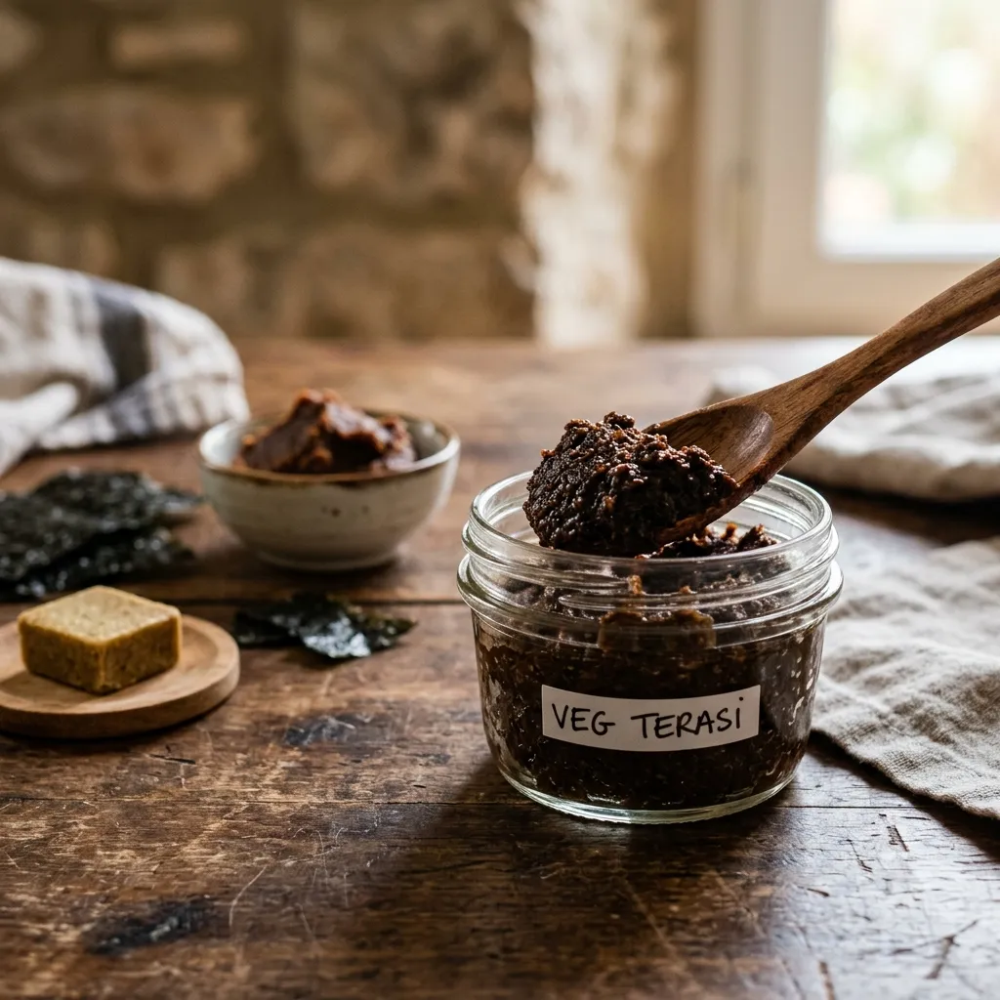

# :bowl_with_spoon: Vegetarian Terasi

{ loading=lazy }

| :timer_clock: Total Time |
|:-----------------------: |
| 5 minutes |

## :salt: Ingredients

- :stew: 1 crumbled vegetable stock cube
- :takeout_box: 2 Tbsp dark or red miso paste
- :leafy_green: 0.5 tsp ground toasted nori seaweed
- :droplet: 1 Tbsp warm water

## :cooking: Cookware

- small bowl

## :pencil: Instructions

### Step 1

Crumble the **vegetable stock cube** into a small bowl.

### Step 2

Add the **dark or red miso paste** and **ground toasted nori seaweed** (or kelp powder) to the bowl.

### Step 3

Stir in the **warm water** and mix thoroughly until a thick, uniform paste forms.

### Step 4

Store the paste in a clean, airtight glass jar in the refrigerator for up to 1 month.

!!! tip "How to Use"

    To use in recipes that call for traditional shrimp paste (terasi or belacan), substitute this mixture in a 1:1 ratio. It is perfect for flavoring curries, stir-fries, and sambals.

!!! tip "Flavor Customization"

    If you want a stronger "oceanic" seafood aroma, increase the nori or kelp powder to 1 teaspoon. For a deeper, earthier flavor, prefer red miso or Korean doenjang over white miso.

## :link: Source

- <https://nicholaswilde.io/recipes/ingredients/vegetarian-terasi>
