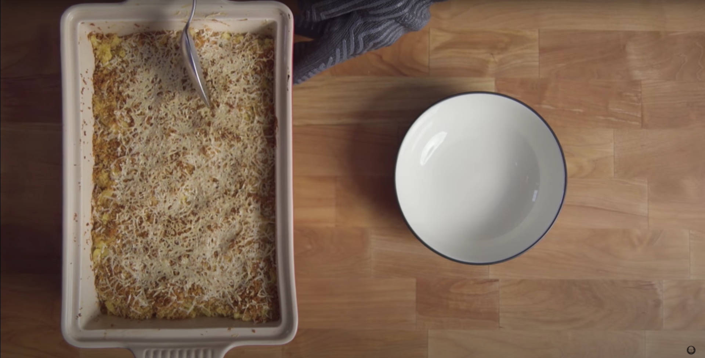

# :spaghetti: Béchamel Macaroni & Cheese

| :timer_clock: Total Time |
|:-----------------------: |
| 35 minutes |

## :salt: Ingredients

- :cheese_wedge: 4 oz Cheddar
- :cheese_wedge: 4 oz Monterey jack
- :cheese_wedge: 6 oz Parmesan
- :salt: some salt
- :salt: some pepper
- :butter: 2 Tbsp butter
- :bread: 0.75 cup panko
- :herb: 2 sprigs thyme
- :spaghetti: 1 lb dried macaroni

## :cooking: Cookware

- 1 medium saucepan
- 1 casserole dish

## :pencil: Instructions

### Step 1

Preheat the oven to 450°F.

### Step 2

Make a béchamel in a medium saucepan.

### Step 3

Add Cheddar, Monterey jack, and Parmesan to the béchamel and whisk over low heat until completely melted.

### Step 4

Season to taste with salt and pepper.

### Step 5

Melt 2 Tbsp of butter in a skillet then add panko and then thyme and toast until beautiful and brown.

### Step 6

Cook dried macaroni pasta and make sure it's under cooked, about 6 minutes.

### Step 7

Add the cheese sauce to the pasta and continue cooking, about 4 minutes.

### Step 8

Place in a well buttered casserole dish and spread the bread crumb mixture over the top of the dish.

### Step 9

Add some grated Parmesan to the top.

### Step 10

Cover and bake for 10 minutes in the oven. Uncover and bake for another 10 to 15 minutes.

## :link: Source

- <https://basicswithbabish.co/basicsepisodes/2017/10/23/sauces>
