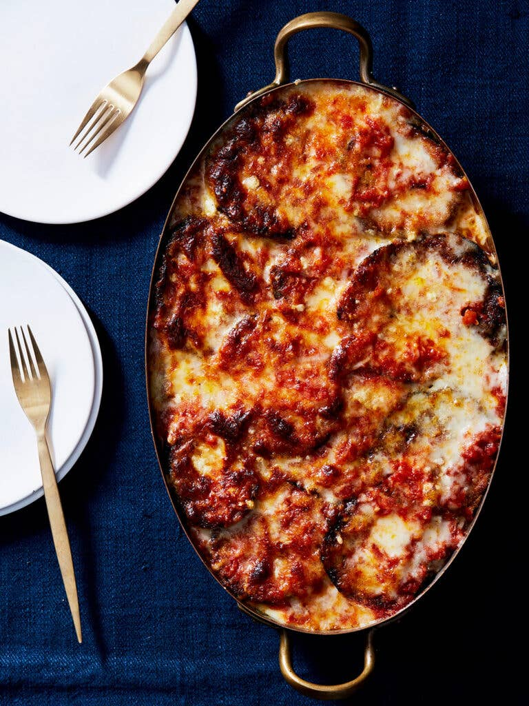

# :eggplant: Eggplant Parmigiana

{ loading=lazy }

| :fork_and_knife_with_plate: Serves | :timer_clock: Total Time |
|:----------------------------------:|:-----------------------: |
| 8-12 | 2.00 hours |

## :salt: Ingredients - Sauce

- :tomato: 1 28-oz can plum tomatoes and their juices
- :olive: 3 Tbsp olive oil
- :garlic: 6 cloves garlic
- :salt: some salt
- :salt: some pepper

## :salt: Ingredients - Eggplant

- :egg: 3 large eggs
- :droplet: 1 Tbsp water
- :salt: 1 pinch salt
- :bread: 1.25 cups dried plain fine bread crumbs
- :herb: 1 Tbsp [Italian seasoning][1]
- :salt: 0.5 tsp salt
- :carrot: 0.5 cup vegetable oil
- :eggplant: 3 medium eggplant
- :cheese_wedge: 10.5 oz mozzarella
- :cheese_wedge: 3 Tbsp Pecorino

## :cooking: Cookware

- 1 blender
- 1 medium–large (4-quart or so) heavy-bottomed pot
- 1 medium baking dish or wide shallow bowl
- 1 large baking sheet
- 1 paper towels
- 1 large high-sided skillet
- 1 9 X 13 inch baking dish

## :pencil: Instructions - Sauce

### Step 1

In a blender, pulse the plum tomatoes and their juices until just slightly chunky. In a medium–large
(4-quart or so) heavy-bottomed pot over medium-low heat, add the olive oil and garlic, and cook, stirring occasionally,
until the garlic is softened slightly and fragrant but not yet browned, about 4 minutes. Pour in the puréed tomato
mixture and season with a generous pinch each of salt and pepper. Bring to a gentle simmer and cook, stirring
frequently, until thickened slightly, at least 1 to 1.5 hours. The sauce can be cooled and refrigerated for up to 2
days.

### Step 2

If you’re baking and serving right away, set a rack in the top third of the oven and preheat to 400°F. If not, skip
the preheat for now.

## :pencil: Instructions - Eggplant

### Step 3

In a medium baking dish or wide shallow bowl, beat the eggs with 1 tablespoon water. Season with a generous pinch of
salt. In a second baking dish or bowl, stir together the dried plain fine bread crumbs, Italian seasoning, and 1/2
teaspoon salt. Working with one or two at a time, dredge the eggplant slices in the egg wash and let the excess drip
back into the bowl. Transfer to the bread crumbs and coat very lightly on each side.

### Step 4

Line a large baking sheet with a few layers of paper towels and set by the stove. In a large high-sided skillet over
medium-high heat, heat 1/2 cup vegetable oil until shimmering. Turn the heat down to medium and add some eggplant slices
in a single layer until the skillet is full. Cook, turning once, until well browned on each side, about 6 minutes total.
Transfer to the prepared baking sheet. Repeat with the remaining eggplant, working in batches as needed and adding a
little more oil every other batch, or as needed. As you work, continue to add layers of paper towels between the
eggplant slices so they remain separate. The fried eggplant can be refrigerated in airtight container for up to 1 day.

### Step 5

In a 9 X 13 inch baking dish, ladle 1/2 cup plus 2 tablespoons sauce into the bottom. Cover the sauce with a single
layer of eggplant (start with the thickest ones on the bottom and save the prettiest slices for the top). Ladle another
1/2 cup sauce on top, spreading it evenly. Sprinkle with about 1/3 cup plus 2 tablespoons mozzarella and 1 tablespoon
Pecorino. Add another layer of eggplant and repeat this process until you’ve reached the final layer of eggplant. Top
this layer only with 1/2 cup sauce, a final thin layer of mozzarella, and some Pecorino. (Reserve any remaining sauce
for another use.) At this point, the eggplant parmigiana can be refrigerated, covered, for up to 1 day.

### Step 6

Bake, uncovered, until the cheese is melted and bronzed in places and the sauce is bubbling around the edges, about 20
minutes (add about 10 minutes if your dish was previously assembled and chilled). Remove and let cool slightly. Slice
into squares and serve warm.

## :link: Sources

- <https://www.saveur.com/best-ever-eggplant-parmigiana/>
- <https://www.thekitchn.com/eggplant-parmesan-recipe-reviews-23048190>

[1]: <../ingredients/seasonings/italian-seasoning.md>
