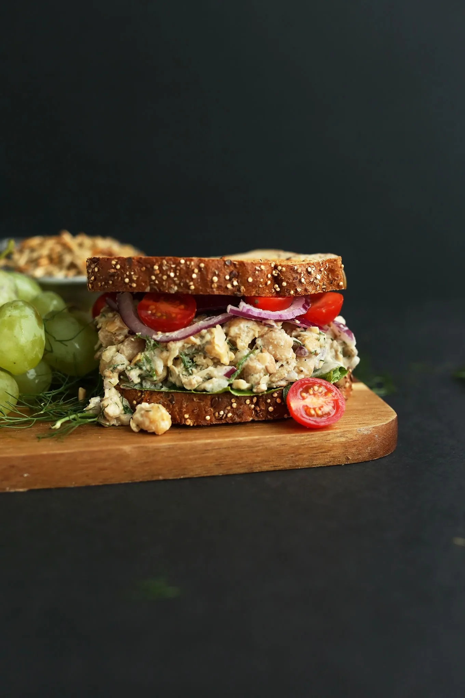

# :sandwich: Chickpea Sunflower Sandwich

{ loading=lazy }

| :fork_and_knife_with_plate: Serves | :timer_clock: Total Time |
|:----------------------------------:|:-----------------------: |
| 4 | 0 minutes |

## :salt: Ingredients

- 0.5 cup hummus
- :tangerine: 2 Tbsp (28 g) lemon juice
- :herb: 2 tsp (6 g) dried dill
- :garlic: 4 cloves garlic
- :glass_of_milk: some unsweetened milk
- :salt: some sea salt
- :beans: 2 cans chickpeas
- :seedling: 0.5 cup (70 g) roasted unsalted sunflower seeds
- :baby_bottle: 6 Tbsp (85 g) vegan mayo
- :seedling: 1 tsp mustard
- :honey_pot: 2 Tbsp (39 g) maple syrup
- :tea: 0.5 cup (105 g) red onion
- :apple: 4 Tbsp dill
- :salt: some salt
- :salt: some pepper
- :potato: 8 slices rustic bread
- :tomato: some tomato
- :tea: some onion
- :cheese_wedge: some lettuce

## :cooking: Cookware

- :bowl_with_spoon: 1 mixing bowl
- :knife: 1 fork

## :pencil: Instructions

### Step 1

Prepare garlic herb sauce and set aside by combining hummus, lemon juice, dried dill, garlic, unsweetened milk, sea
salt

### Step 2

Add chickpeas to a mixing bowl and lightly mash with a fork for texture. Then add roasted unsalted sunflower seeds,
vegan mayo, mustard, maple syrup, red onion, dill, salt, and pepper and mix with a spoon. Taste and adjust seasonings
as needed.

### Step 3

Toast rustic bread (if desired) and prepare any other sandwich toppings you desire, tomato, onion, and lettuce.

### Step 4

Scoop a healthy amount of filling onto two of the pieces of bread, add desired toppings and sauce, and top with other
two slices of bread.

### Step 5

Sunflower-chickpea mixture will keep covered in the fridge for up to a few days, making it great for quick weekday
lunches.

## :link: Source

- <https://minimalistbaker.com/chickpea-sunflower-sandwich/>
