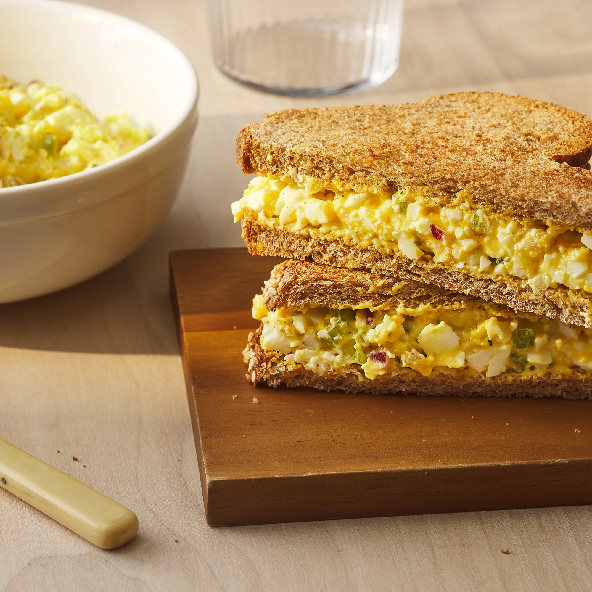

# :sandwich: Egg Salad Sandwich

{ loading=lazy }

| :fork_and_knife_with_plate: Serves | :timer_clock: Total Time |
|:----------------------------------:|:-----------------------: |
| 4 | 5 minutes |

## :salt: Ingredients

- :leafy_green: 2 hearts celery
- :tea: 0.25 cup (24 g) onion or shallot
- :wine_glass: 1 Tbsp champagne vinegar
- :egg: 8 hard-boiled egg
- :glass_of_milk: 2 Tbsp (28 g) Greek yogurt
- :seedling: 1 Tbsp (10 g) yellow mustard
- :baby_bottle: 1 Tbsp (14 g) mayonnaise
- :apple: 1 tsp dill
- 1 tsp (1 g) chives
- :salt: 0.25 tsp salt
- :salt: 0.25 tsp pepper

## :cooking: Cookware

- :bowl_with_spoon: 1 medium bowl

## :pencil: Instructions

### Step 1

Stir celery, onion or shallot and champagne vinegar together in a medium bowl; let stand at room temperature until the
onion is bright red, about 5 minutes.

### Step 2

Add hard-boiled egg halves to the bowl; mash with a fork until finely crumbled. Add Greek yogurt, yellow mustard,
mayonnaise, dill, chives, salt, and pepper; stir until well combined. Garnish with additional dill and chives, if
desired.

## :link: Source

- <https://www.eatingwell.com/recipe/8032579/best-egg-salad-recipe/>
