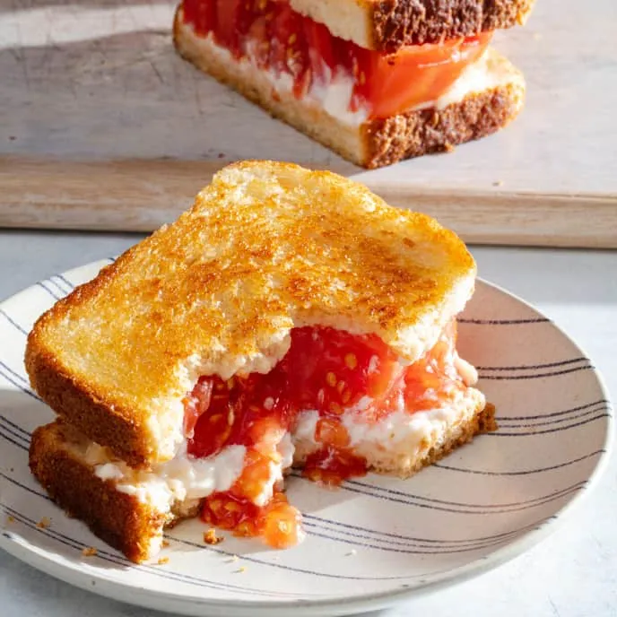

# :sandwich: Grilled Tomato Sandwich

{ loading=lazy }

| :fork_and_knife_with_plate: Serves | :timer_clock: Total Time |
|:----------------------------------:|:-----------------------: |
| 2 | 25 minutes |

## :salt: Ingredients

- :glass_of_milk: 0.75 tsp (4 g) cream of tartar
- :salt: 0.75 tsp salt
- :candy: 0.5 tsp (2 g) granulated sugar
- :salt: 0.25 tsp pepper
- :tomato: 2 4-inch field or heirloom tomato
- 8 tsp [mayonnaise][1]
- :beans: 4 slices hearty white sandwich bread

## :cooking: Cookware

- :bowl_with_spoon: 1 small bowl

## :pencil: Instructions

### Step 1

Stir cream of tartar, salt, granulated sugar, and pepper together in small bowl. Sprinkle mixture on both sides of field
or heirloom tomato slices that are 3/4 inch thick. Spread 1 teaspoon [mayonnaise][1] on 1 side of each slice of bread.

### Step 2

Place 2 slices of hearty white sandwich bread, mayonnaise side down, in 12-inch skillet. Cook over medium heat, moving
bread if necessary for even browning, until underside is golden brown, 2 to 3 minutes. Transfer to cutting board
griddled side up. Cook remaining 2 bread slices until underside is golden brown, about 30 seconds. Let cool until
griddled side is crisp, about 2 minutes.

!!! note

    Choose ripe tomatoes that are heavy for their size. Larger tomato slices that cover the entire slice of bread are
    ideal. We developed this recipe with 3/2 by 5-inch slices of Arnold sandwich bread, and the amount of mayonnaise
    used in step 1 is just enough to thinly cover each slice. Adjust this amount as necessary if your bread has
    different dimensions.

## :link: Source

- Cook's Illustrated

[1]: <../sauces-and-dressings/dips-and-spreads/mayonnaise.md>
