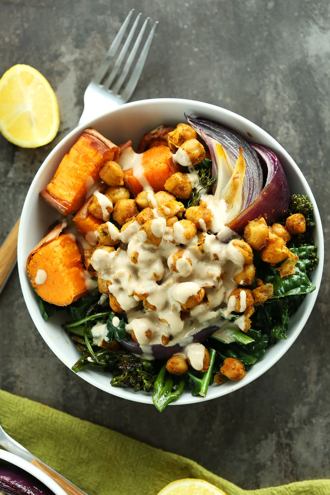

# :stuffed_flatbread: Mexican Power Bowl

{ loading=lazy }

| :fork_and_knife_with_plate: Serves | :timer_clock: Total Time |
|:----------------------------------:|:-----------------------: |
| 8 | 8.00 hours |

## :salt: Ingredients

- :burrito: 2.5 cups (438 g) [dried black beans][1]
- :stew: 7 cups low-sodium [Vegetable Broth](../ingredients/vegetable-broth.md)
- :tea: 1 large onion
- :garlic: 6 cloves garlic
- :chestnut: 2 tsp (6 g) ground cumin
- :herb: 1 tsp (2 g) dried Mexican oregano
- :hot_pepper: 1 tsp smoked paprika
- :herb: 1 bay leaf
- :ear_of_rice: 4 cups (736 g) cooked quinoa
- :chestnut: 4 cups (960 g) roasted sweet potatoes
- :leafy_green: 8 cups spinach
- :tomato: 1 cup salsa
- :avocado: 1 avocado
- :herb: some cilantro

## :cooking: Cookware

- 1 slow cooker

## :pencil: Instructions

### Step 1

Combine the [dried black beans][1], low-sodium [Vegetable Broth](../ingredients/vegetable-broth.md), diced large onion, minced garlic, ground cumin, dried
Mexican oregano, smoked paprika and bay leaf in a slow cooker.

### Step 2

Cook on high for 4 hours or on low for 8 hours.

### Step 3

Drain any excess liquid.

### Step 4

Place 1 cup of spinach (or mixed greens) and 1/2 cup cooked quinoa (or brown rice) in a container. Add 1/2 cup seasoned
[black beans][1] and 1/2 cup roasted sweet potatoes. Add your favorite salsa.

### Step 5

Top with sliced avocado and fresh cilantro.

## :link: Source

- <https://thefitchen.com/mexican-power-bowl/>

[1]: <../ingredients/black-beans.md>
