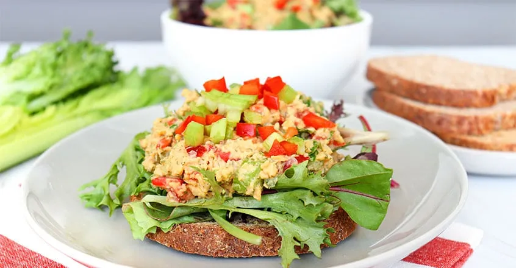

# :falafel: Dr. Campbell Perfect Chickpea Salad Sandwich Spread

{ loading=lazy }

| :timer_clock: Total Time |
|:-----------------------: |
| 10 minutes |

## :salt: Ingredients

- :beans: 1 can chickpeas
- :leafy_green: 2 stalks celery
- :hot_pepper: 0.33 cup (47 g) bell pepper
- :cucumber: 0.33 cup (50 g) pickles
- 0.25 cup hummus
- :seedling: 1.5 tsp mustard
- :apple: 1 Tbsp dill
- :herb: 0.25 cup parsley
- :tangerine: 4 Tbsp (56 g) lemon juice
- :salt: 1 pinch salt
- :salt: 1 pinch pepper
- :bread: some whole grain pita bread pockets

## :cooking: Cookware

- :bowl_with_spoon: 1 large bowl
- :spoon: 1 potato masher

## :pencil: Instructions

### Step 1

In a large bowl, mash the chickpeas with a potato masher until flaky in texture.

### Step 2

Add the celery, bell pepper, pickles, hummus, mustard, dill, parsley, and lemon juice. Mix well. Sprinkle with salt and
pepper, adjusting seasoning to taste.

### Step 3

Serve on toasted whole grain Ezekiel muffins, or in whole grain pita bread pockets.

## :link: Source

- <https://nutritionstudies.org/recipes/salad/perfect-chickpea-salad/>
