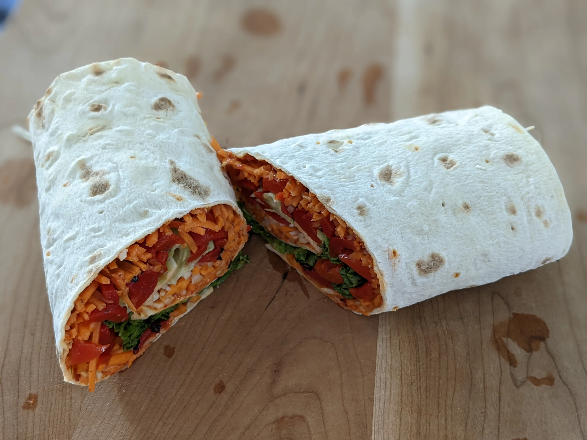

# :flatbread: Romesco Wrap

{ loading=lazy }

| :fork_and_knife_with_plate: Serves | :timer_clock: Total Time |
|:----------------------------------:|:-----------------------: |
| 2 | 10 minutes |

## :salt: Ingredients

- 0.5 cup [TJ's Romesco sauce][1]
- :four_leaf_clover: 1 sheet TJ's Lavash bread
- :coconut: 1 handful shredded carrots
- :coconut: 1 handful shredded Kohlrabi
- :hot_pepper: 1 jar TJ's [roasted red peppers][2]
- :wine_glass: 3 leaves red leaf lettuce

## :pencil: Instructions

### Step 1

Spread TJ's Romesco sauce over TJ's Lavash bread.

### Step 2

Sprinkle shredded carrots and shredded Kohlrabi; over spread, then layer sliced TJ's [roasted red peppers][2] and red
leaf lettuce.

### Step 3

Roll tightly then cut in half and serve.

[1]: <../main/roasted-cauliflower-tacos-with-chipotle-romesco.md#sauce>
[2]: <../ingredients/roasted-red-peppers.md>
