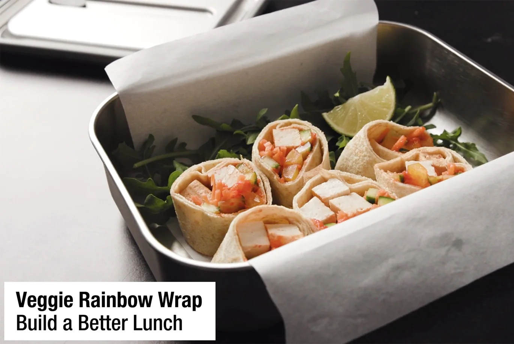

# :rainbow: Veggie Rainbow Wrap

| :fork_and_knife_with_plate: Serves | :timer_clock: Total Time |
|:----------------------------------:|:-----------------------: |
| 1 | 5 minutes |

## :salt: Ingredients

- :flatbread: 2 TJ's egg wraps
- :hot_pepper: 2 Tbsp TJ's red pepper spread
- :bell_pepper: 0.25 bell peppers sliced into matchsticks
- :cucumber: 1 Persian cucumber sliced into matchsticks
- :carrot: 0.25 cup shredded carrots
- :butter: 1 block Sriracha flavored baked tofu
- :lemon: 1 tsp lime juice

## :pencil: Instructions

### Step 1

Lay both TJ's egg wraps on top of one another on your work surface.

### Step 2

About an inch above the bottom edge of the wrap, add TJ's red pepper spread in a horizontal line, an inch thick, leaving
about a half-inch gap on the left and right side of the wrap.

### Step 3

Arrange bell peppers sliced into matchsticks, lengthwise in an inch-thick row just above the spread, leaving the same
half-inch gap on the left and right side.

### Step 4

Repeat with Persian cucumber sliced into matchsticks and shredded carrots, laying each row just above the previous
veggie.

### Step 5

Place Sriracha flavored baked tofu above veggies.

### Step 6

Drizzle lime juice over the veggies.

### Step 7

Roll tightly and cut into 6 pieces.

## :link: Source

- <https://www.traderjoes.com/home/recipes/veggie-rainbow-wrap>
