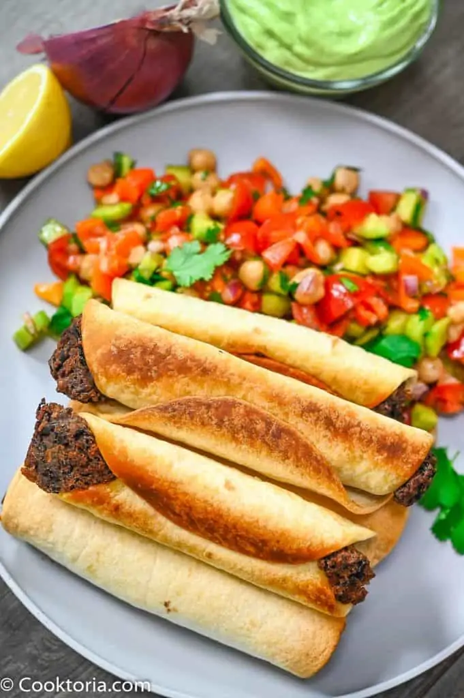

# :stuffed_flatbread: Baked Black Bean Taquitos

{ loading=lazy }

| :fork_and_knife_with_plate: Serves | :timer_clock: Total Time |
|:----------------------------------:|:-----------------------: |
| 12 taquitos | 45 minutes |

## :salt: Ingredients

- :canned_food: 2 14-oz cans [black beans][1]
- :stew: 1 cup vegetable stock
- :hot_pepper: 1 tsp paprika
- :herb: 0.5 tsp cumin
- :salt: 0.25 tsp salt
- :salt: 0.25 tsp pepper
- :cheese_wedge: 1 cup shredded cheddar or Monterey jack cheese
- :bread: 12 corn or flour tortillas
- :olive: 1 Tbsp extra virgin olive oil

## :cooking: Cookware

- 1 medium saucepan
- 1 baking sheet

## :pencil: Instructions

### Step 1

Preheat the oven to 425°F (200°C). Grease a baking sheet with olive oil.

### Step 2

Simmer the [black beans][1], vegetable stock, paprika, cumin, salt, and pepper for 15 minutes, until the liquid has
almost evaporated.

### Step 3

Remove from heat and stir in the cheese.

### Step 4

Warm the tortillas in the microwave for 30 seconds until pliable.

### Step 5

Place about 2 tablespoons of the black bean mixture in the center of each tortilla. Roll up the tortillas and place them
seam-side down on the prepared baking sheet.

### Step 6

Brush the taquitos with olive oil.

### Step 7

Bake for 15 to 20 minutes until the taquitos are golden and crispy.

### Step 8

Serve with salsa, guacamole, or sour cream.

## :link: Source

- <https://thefitchen.com/baked-black-bean-taquitos/>

[1]: <../ingredients/black-beans.md>
