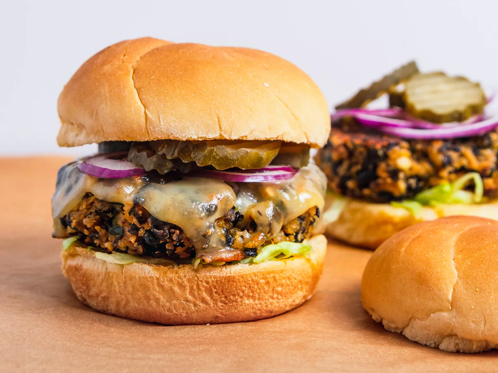

# :hamburger: Black Bean Burgers

{ loading=lazy }

| :fork_and_knife_with_plate: Serves | :timer_clock: Total Time |
|:----------------------------------:|:-----------------------: |
| 6 burgers | 1 hour |

## :salt: Ingredients

- :beans: 2 15-oz cans [black beans][1]
- :olive: 2 Tbsp extra virgin olive oil
- :onion: 0.5 cup (80 g) chopped bell pepper
- :onion: 0.5 cup (80 g) chopped onion
- :garlic: 3 cloves garlic
- :herb: 1.5 tsp ground cumin
- :hot_pepper: 1 tsp chili powder
- :hot_pepper: 0.5 tsp garlic powder
- :hot_pepper: 0.25 tsp smoked paprika
- :bread: 0.5 cup (60 g) breadcrumbs
- :cheese_wedge: 0.5 cup (50 g) feta cheese (optional)
- :egg: 2 large eggs
- :salt: some salt
- :salt: some black pepper

## :cooking: Cookware

- 1 foil-lined rimmed baking sheet
- 1 small sauté pan
- 1 food processor
- 1 large bowl

## :pencil: Instructions

### Step 1

Adjust oven rack to center position and preheat oven to 350°F (175°C). Spread [black beans][1] in a single layer on a
foil-lined rimmed baking sheet. Roast until beans are mostly split open and outer skins are beginning to get crunchy,
about 20 minutes. Remove from oven and allow to cool slightly.

### Step 2

While beans are roasting, heat olive oil in a small sauté pan over medium heat. Add bell pepper, onion, and garlic. Cook
until vegetables are softened, about 5 minutes. Squeeze out as much moisture as possible using a clean kitchen towel or
fine-mesh strainer.

### Step 3

In a food processor, pulse the roasted [black beans][1] until they are mostly broken down but still have some texture.
Transfer to a large bowl.

### Step 4

Add the sautéed vegetables to the bowl along with cumin, chili powder, garlic powder, smoked paprika, breadcrumbs, feta
cheese (if using), eggs, salt, and pepper. Mix everything together with a fork until well combined.

### Step 5

Form the mixture into 6 patties.

### Step 6

To cook the burgers, heat a little oil in a large nonstick or cast-iron skillet over medium-high heat. Cook the patties
for 4 to 5 minutes per side until browned and heated through. Alternatively, grill the patties over medium-high heat
for 4 to 5 minutes per side.

### Step 7

Serve on buns with your favorite toppings.

## :link: Source

- <https://sallysbakingaddiction.com/best-black-bean-burgers/>

[1]: <../ingredients/black-beans.md>
