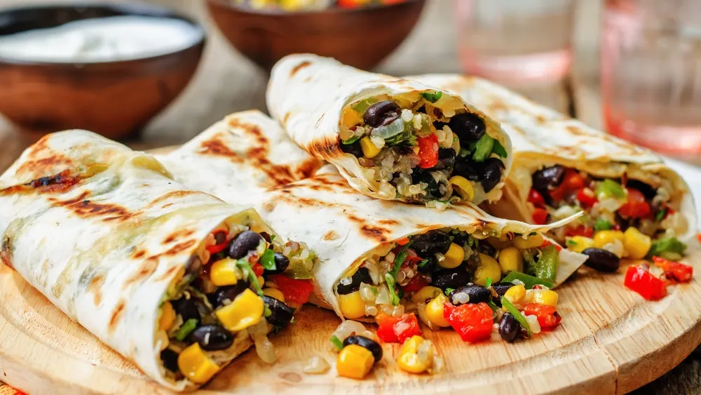

# :burrito: Black Bean Burritos

{ loading=lazy }

| :fork_and_knife_with_plate: Serves | :timer_clock: Total Time |
|:----------------------------------:|:-----------------------: |
| 4 | 20 minutes |

## :salt: Ingredients

- :apple: 1 chipotle chile in adobo sauce
- :cheese_wedge: 0.5 cup (114 g) reduced fat sour cream
- :glass_of_milk: 1 15-oz can [black beans][1]
- :corn: 1 cup (312 g) corn
- :bread: 4 tortillas
- :tomato: 1 cup salsa
- :cheese_wedge: 0.5 cup (56 g) jack cheese

## :cooking: Cookware

- :gear: 1 food processor
- 1 baking dish

## :pencil: Instructions

### Step 1

Preheat oven to 350°F.

### Step 2

Chop chipotle chile in adobo sauce and combine with reduced fat sour cream.

### Step 3

Place half of [black beans][1] in food processor; combine all beans, corn, and sour cream mixture.

### Step 4

Spoon 1/2 cup mixture into tortillas and place in baking dish. Cover with salsa and jack cheese.

### Step 5

Cover and bake for 20 minutes.

[1]: <../ingredients/black-beans.md>
