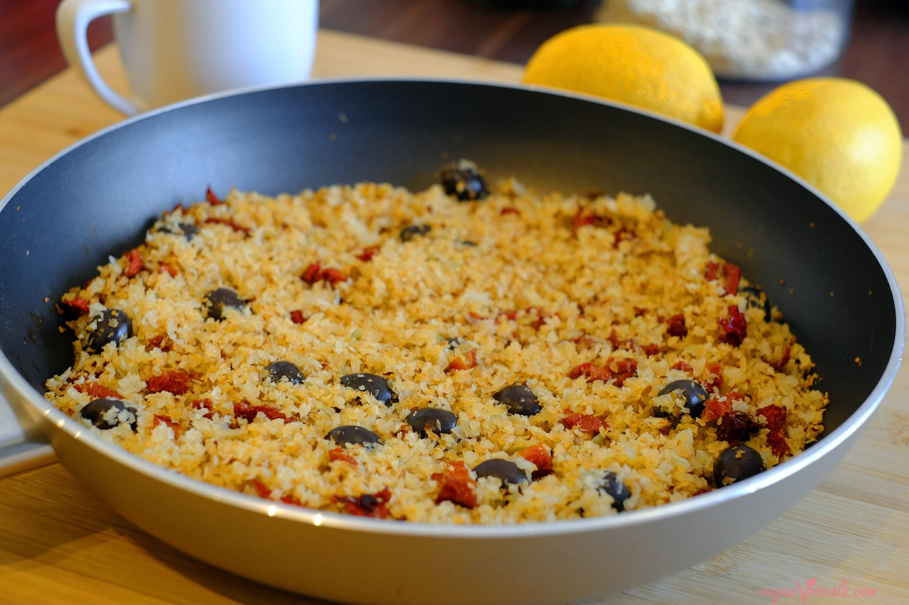

# Cabbage and Sun-dried Tomato Sauté

| :fork_and_knife_with_plate: Serves | :timer_clock: Total Time |
|:----------------------------------:|:-----------------------: |
| 4 | 12 minutes |

## :salt: Ingredients

- 4 sun-dried tomatoes
- 2 small heads cabbage
- 1 cup green onions
- 1 sweet onion (Vidalia)
- 3 Tbsp olive oil
- some salt
- some pepper
- some fava beans
- some mint
- some scallions
- some fennel

## :cooking: Cookware

- 1 large sauté pan

## :pencil: Instructions

### Step 1

Set a large sauté pan over medium-high heat. Cook rinsed and chopped sun-dried tomatoes, thinly sliced cabbage, sliced
green onions, thinly sliced sweet onion (Vidalia) in olive oil for 10 to 12 minutes or until cooked through but not too
brown.

### Step 2

Stir and toss frequently; turn down heat to medium (if needed) to avoid burning.

### Step 3

Add salt and pepper to taste before serving.

### Step 4

Serve with fresh fava beans with mint and scallions and fennel and potato cassola.

## :link: Source

- The Blue Zones Kitchen
