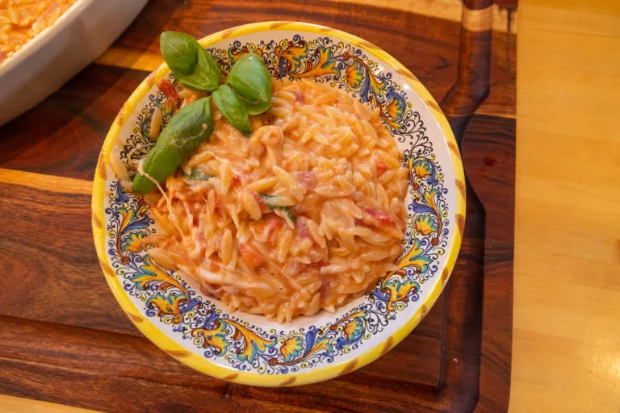

# :spaghetti: Caprese Risoni

{ loading=lazy }

| :timer_clock: Total Time |
|:-----------------------: |
| 14 minutes |

## :salt: Ingredients

- 1 pkg Risoni
- :tomato: 6 organic tomatoes on a vine
- :glass_of_milk: 1 can cannellini beans
- 0.25 cup [pesto][1]
- :apple: 1 container optional Ciliegine fresh mozzarella
- 3 Tbsp balsamic glaze

## :cooking: Cookware

- :shallow_pan_of_food: 1 medium saucepan

## :pencil: Instructions

### Step 1

In a medium saucepan, bring 1.5 cups of water to a boil. Stir in Risoni and return to a boil. Reduce heat and simmer
uncovered for 9 minutes, stirring occasionally.

### Step 2

Remove from heat and let stand, covered, for 5 minutes.

### Step 3

Chop organic tomatoes on a vine and mix cannellini beans, pesto, and optional Ciliegine fresh mozzarella.

### Step 4

Serve and drizzle with balsamic glaze.

## :link: Source

- Recipe Box

[1]: <../sauces-and-dressings/gravy-and-savory-sauces/pesto/joy-of-cooking-pesto.md>
