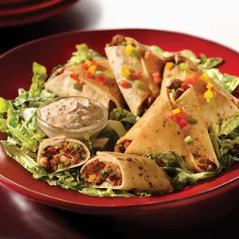

# :flatbread: Cheesy Black Bean Quesadilla Triangles

{ loading=lazy }

| :timer_clock: Total Time |
|:-----------------------: |
| 12 minutes |

## :salt: Ingredients

- :hamburger: 2 MorningStar Farms chipotle black bean burgers
- :tomato: 0.5 cup salsa
- :orange_circle: 0.5 cup (56 g) shredded cheddar or jack cheese
- :cheese_wedge: 0.25 cup (28 g) shredded pepper jack cheese
- :shell: 2 tsp (5 g) Southwest or Mexican seasoning
- :bread: 10 flour tortillas
- :glass_of_milk: 1 Tbsp (17 g) melted butter
- :cheese_wedge: 2.5 cups (302 g) shredded lettuce
- :hot_pepper: 2 Tbsp (18 g) red or green bell pepper

## :cooking: Cookware

- :bowl_with_spoon: 1 medium bowl
- 1 pizza cutter
- :cookie: 1 baking sheet

## :pencil: Instructions

### Step 1

shredded cheddar or jack cheese, shredded pepper jack cheese, and Southwest or Mexican seasoning.
In a medium bowl, toss together MorningStar Farms chipotle black bean burgers thawed and cut into 1/4" pieces, salsa,

### Step 2

Use a pizza cutter to cut flour tortillas into 7" triangles.

### Step 3

Place about 2 Tbsp of burger mixture into center of each triangle. Fold corners of large triangles over filling,
completely enclosing filling and making small triangles. Secure with toothpicks.

### Step 4

Place on baking sheet. Brush with melted butter and bake at 375°F for 9 to 12 minutes.

### Step 5

Arrange on top of shredded lettuce. Spring with finely chopped red or green bell pepper.

## :link: Sources

- MorningStar Farms
- Recipe Box
