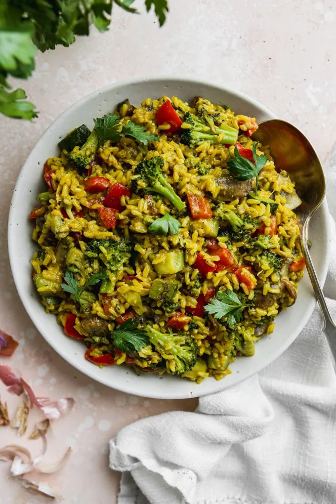

# :coconut: Coconut Curried Vegetables with Rice

{ loading=lazy }

## :salt: Ingredients

- :ear_of_rice: 3 cups (84 g) rice
- :bread: 2 Tbsp (12 g) flour
- :curry: 1.5 tsp (5 g) curry powder
- :salt: 0.5 tsp salt
- :salt: 0.13 tsp pepper
- :coconut: 1 14-oz can coconut milk
- :tangerine: 1 tsp (5 g) lime juice
- :carrot: 1 lbs frozen vegetables
- :beans: 1 cup (150 g) frozen peas

## :cooking: Cookware

- :birthday: 1 wire whisk
- :shallow_pan_of_food: 1 sauce pan

## :pencil: Instructions

### Step 1

While rice is cooking, combine flour, curry powder, salt, pepper, and 1/4 cup coconut milk.

### Step 2

Beat with wire whisk until smooth. Stir in remaining coconut milk and lime juice. Set aside.

### Step 3

In a sauce pan, combine frozen vegetables and frozen peas with 1/2 cup water. Cook, then drain and set aside.

### Step 4

Mix veggies with coconut mixture and bring to a boil.
