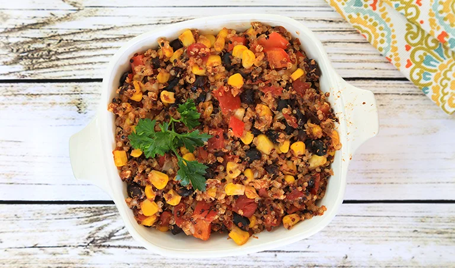

# :ear_of_rice: Cowboy Quinoa Bake

{ loading=lazy }

| :fork_and_knife_with_plate: Serves | :timer_clock: Total Time |
|:----------------------------------:|:-----------------------: |
| 4 | 47 minutes |

## :salt: Ingredients

- :ear_of_rice: 1 cup dry quinoa
- :droplet: 2 cups water
- :tomato: 1 jar Cowboy Caviar Salsa
- :tomato: 1 can Diced Tomatoes
- :cheese_wedge: 1 cup Mexican Blend Shredded Cheese
- :olive: some Organic Olive Oil Spray
- :rice: some Sour Cream
- :herb: 1 Cilantro

## :cooking: Cookware

- 1 medium saucepan
- 1 fork.
- 1 large bowl
- 1 8-inch square baking pan

## :pencil: Instructions

### Step 1

Preheat oven to 350°. Add dry quinoa and 2 cups water to a medium saucepan. Bring to a boil and reduce to a simmer.
Cover and cook for 10 to 12 minutes, until water is completely absorbed. Turn off heat and fluff quinoa with a fork.

### Step 2

In a large bowl, fold together cooked Quinoa, Cowboy Caviar Salsa, Diced Tomatoes and Mexican Blend Shredded Cheese,
just until mixed. Grease an 8-inch square baking pan with Organic Olive Oil Spray and spread mixture into pan. Cook for
25 minutes, then turn broiler on high and cook 5 minutes more. Remove from oven and let cool 5 minutes. Top with Sour
Cream and Cilantro, if desired and serve.

## :link: Sources

- Trader Joe's
- Recipe Box
