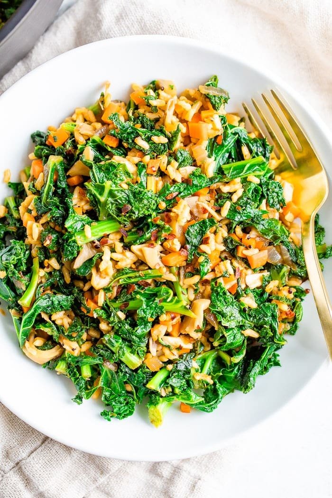

# :stuffed_flatbread: Greens and Grains Bowls

{ loading=lazy }

| :fork_and_knife_with_plate: Serves | :timer_clock: Total Time |
|:----------------------------------:|:-----------------------: |
| 4 | 30 minutes |

## :salt: Ingredients

- :ear_of_rice: 4 cups cooked brown rice
- :sweet_potato: 4 cups cooked sweet potato
- :beans: 1 15-oz can [black beans][1]
- :hot_pepper: 2 cups chopped bell pepper
- :leafy_green: 6 cups raw spinach or kale
- :avocado: 1 avocado
- :herb: some cilantro
- :lemon: some lime wedges
- :sauce: some [creamy tahini dressing][2]

## :cooking: Cookware

- 1 large bowl

## :pencil: Instructions

### Step 1

In a large bowl, mix together cooked brown rice, cooked sweet potato, [black beans][1], chopped bell pepper, and raw
spinach or kale.

### Step 2

Divide the mixture between 4 bowls.

### Step 3

Top each bowl with sliced avocado and fresh cilantro.

### Step 4

Serve with lime wedges and [creamy tahini dressing][2].

## :link: Source

- <https://cookieandkate.com/greens-and-grains-bowl-recipe/>

[1]: <../ingredients/black-beans.md>
[2]: <../sauces-and-dressings/dips-and-spreads/tahini.md>
