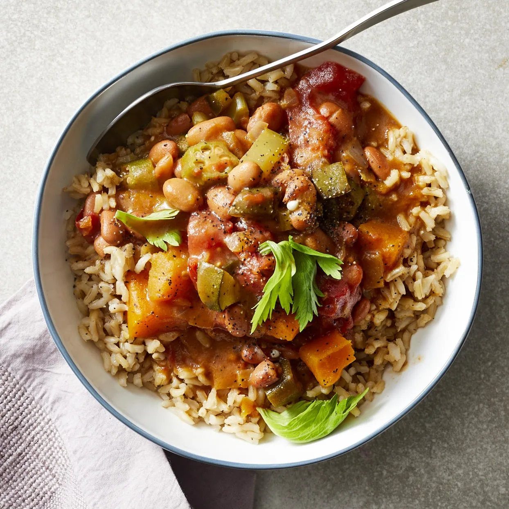

# :stew: Gumbo

{ loading=lazy }

| :timer_clock: Total Time |
|:-----------------------: |
| 18 minutes |

## :salt: Ingredients

- :butter: 0.5 oz (14 g) unsalted butter
- :tea: 0.25 cup (36 g) diced onion
- :tea: 0.25 cup (36 g) diced celery
- :bread: 0.5 oz (6 g) flour
- :tangerine: 0.5 cup okra
- :stew: 8 cups (1584 g) vegetable stock
- 0.5 Tbsp gumbo filé
- :tomato: 0.5 cup (71 g) diced tomatoes
- :hot_pepper: 0.5 Tbsp cayenne (or less)
- :salt: 0.5 tsp (1 g) white pepper
- :ear_of_rice: 1.5 cups (255 g) cooked rice
- :salt: some salt
- :salt: some pepper

## :cooking: Cookware

- 1 large soup pot

## :pencil: Instructions

### Step 1

In a large soup pot, melt unsalted butter.

### Step 2

Add diced onion and diced celery; sauté until tender.

### Step 3

Add flour to make a roux. Cook for 3 minutes.

### Step 4

Add okra, vegetable stock, gumbo filé, diced tomatoes, cayenne (or less), white pepper, cooked rice, and salt and
pepper to taste and bring to a boil.

### Step 5

Simmer for 15 minutes.
