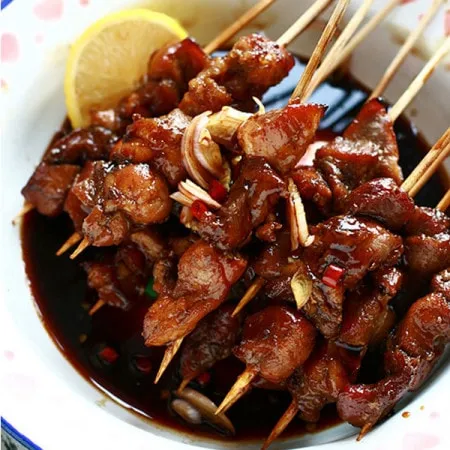

# :meat_on_bone: Indonesian Satay

{ loading=lazy }

| :timer_clock: Total Time |
|:-----------------------: |
| 1 day |

## :salt: Ingredients

- :tangerine: 1 lemon
- :salt: 0.5 tsp pepper
- :salt: 1 tsp salt
- :chestnut: 0.5 tsp (1 g) coriander
- :chestnut: 0.5 tsp (2 g) cumin
- :maple_leaf: 6 Tbsp (80 g) brown sugar
- :garlic: 3 cloves garlic
- :apple: 1.5 cups (360 g) Indonesian sweet soy sauce (sweet medium ketchup)
- 2 lbs top sirloin

## :cooking: Cookware

- 1 skewer

## :pencil: Instructions

### Step 1

Make the marinade by adding the juice of 1 lemon, pepper, salt, coriander, cumin, 3 to 6 Tbsp of brown sugar, garlic,
and Indonesian sweet soy sauce (sweet medium ketchup).

### Step 2

Marinate cubed and cut top sirloin with the fat cut off, pieces at least a day in sauce and place on a skewer to
barbecue.

## :link: Source

- Tante Myrna Seccia
