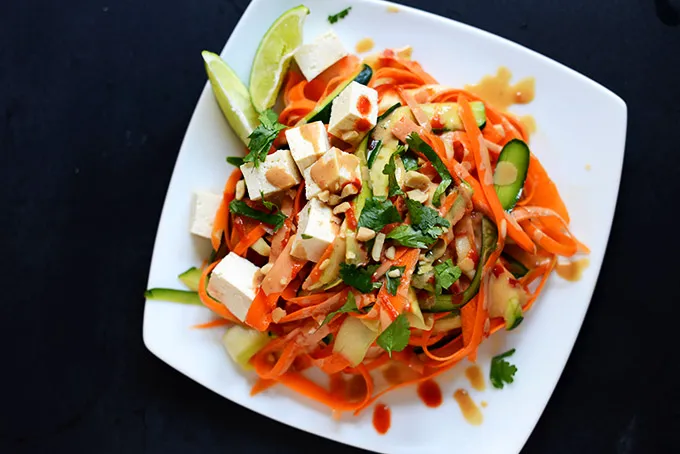

# :curry: Noodle-Free Pad Thai

{ loading=lazy }

| :fork_and_knife_with_plate: Serves | :timer_clock: Total Time |
|:----------------------------------:|:-----------------------: |
| 2 | 10 minutes |

## :salt: Ingredients

- :cheese_wedge: 0.5 cup (1 TJ's block) extra firm tofu
- :takeout_box: 1 Tbsp (8 g) coconut aminos
- :hot_pepper: 0.13 tsp (1 g) red pepper flakes
- :curry: 0.25 tsp (1 g) turmeric
- :carrot: 5 carrots
- :hot_pepper: 1 medium red peppers
- :tea: 3 green onions
- 2.5 Tbsp [peanut butter][1]
- :tangerine: 3 Tbsp (43 g) lime juice
- :hot_pepper: 0.5 tsp (2 g) red pepper flakes
- :honey_pot: 1.5 Tbsp (29 g) maple syrup
- :takeout_box: 2 Tbsp (16 g) coconut aminos
- :olive: 1 Tbsp (14 g) sesame oil
- :hot_pepper: 1 jalapeño
- :coconut: 1.5 cups (182 g) shredded cabbage
- :takeout_box: 1 Tbsp (8 g) coconut aminos
- :takeout_box: 1 Tbsp (8 g) coconut aminos
- :sweet_potato: 0.5 tsp (2 g) fresh ginger
- :curry: 0.5 tsp (2 g) turmeric
- :herb: some cilantro

## :cooking: Cookware

- :gear: 1 food processor
- 1 bowl
- :gear: 1 immersion blender
- 1 skillet

## :pencil: Instructions

### Step 1

Press excess water out of extra firm tofu, then blitz in a food processor or into a crumble. Mix in 1 Tbsp coconut
aminos, 1/8 tsp red pepper flakes, and 1/4 tsp turmeric. Set aside.

### Step 2

Slice carrots, red peppers, and green onions in a food processor.

### Step 3

In a separate bowl, mix peanut butter, lime juice, 1/2 tsp red pepper flakes, maple syrup, and 2 Tbsp coconut aminos and
bled with immersion blender.

### Step 4

Heat skillet to medium and add sesame oil. Add sliced jalapeño, shredded cabbage, and 1 Tbsp coconut aminos. Cook 3
minutes, stirring frequently.

### Step 5

Add tofu and sauté 3 to 5 minutes, stirring frequently.

### Step 6

Add 1 Tbsp coconut aminos and sauté 2 minutes.

### Step 7

Add sauce, fresh ginger, and 1/2 tsp turmeric. Sauté and heat until warmed through.

### Step 8

Serve with chopped cilantro.

## :link: Source

- Recipe Box

[1]: <../ingredients/peanut-butter.md>
