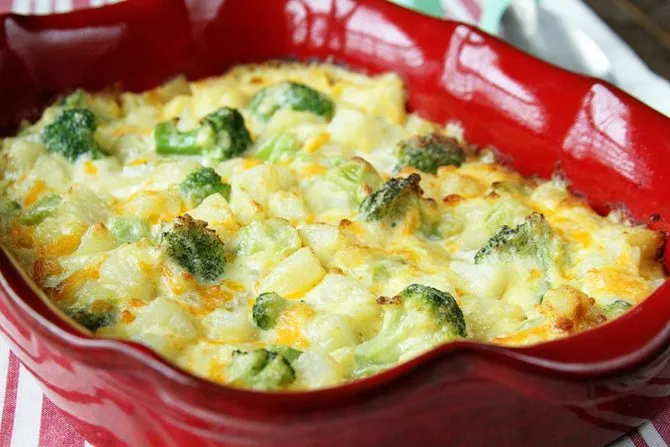

# :potato: Potato Broccoli Casserole

{ loading=lazy }

| :timer_clock: Total Time |
|:-----------------------: |
| 17 minutes |

## :salt: Ingredients

- :sweet_potato: 1.5 lbs potatoes
- :butter: 0.25 cup (56 g) unsalted butter
- :bread: 3 Tbsp (17 g) flour
- :glass_of_milk: 2.5 cups (568 g) milk
- :salt: 0.5 tsp salt
- :salt: 0.25 tsp pepper
- :broccoli: 3 cups (273 g) broccoli

## :cooking: Cookware

- :shallow_pan_of_food: 1 saucepan
- 1 casserole dish

## :pencil: Instructions

### Step 1

Preheat oven to 350°F.

### Step 2

Cut potatoes into thin slices.

### Step 3

Heat unsalted butter in saucepan; sprinkle with flour, and cook for 2 minutes. Add milk, salt, and pepper. Simmer until
boiling. Remove from heat.

### Step 4

In a casserole dish, layer potatoes and broccoli. Top with white sauce.

### Step 5

Cover and bake for 15 minutes, then an additional 5 uncovered.
