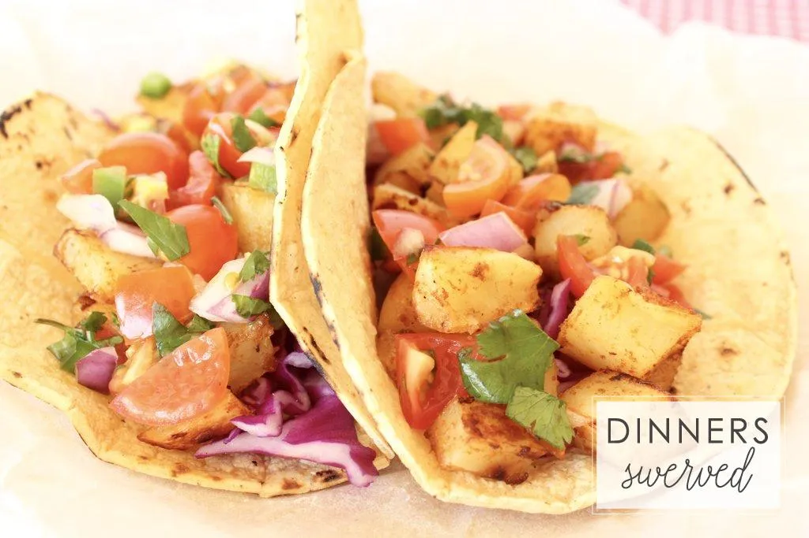

# :taco: Potato Tacos

{ loading=lazy }

| :fork_and_knife_with_plate: Serves | :timer_clock: Total Time |
|:----------------------------------:|:-----------------------: |
| 8 | 27 minutes |

## :salt: Ingredients

- :sweet_potato: 1 lb potatoes
- :olive: 1 Tbsp (12 g) olive oil
- :salt: 1 bell pepper
- 2 Tbsp [taco seasoning][3]
- :glass_of_milk: 1 15-oz can [black beans][2]
- :glass_of_milk: 1 15-oz can [refried beans][1]
- :bread: 8 tortillas

## :cooking: Cookware

- 1 cast iron skillet
- 1 pot

## :pencil: Instructions

### Step 1

Chop the potatoes and boil until tender, about 15 minutes.

### Step 2

After potatoes cook, heat olive oil in a cast iron skillet. Add chopped bell pepper, potatoes, and taco seasoning. Cook
5 to 7 minutes, then flip and cook 5 minutes more or until golden/crispy.

### Step 3

While potatoes cook, add [black beans][2] and [refried beans][1] in a pot. Mix together and heat through.

### Step 4

Heat tortillas according to preference.

### Step 5

To assemble tacos, layer beans and potato/pepper mix, then add toppings as desired.

## :link: Source

- Recipe Box

[1]: <../sides/grains-and-legumes/refried-black-beans.md>
[2]: <../ingredients/black-beans.md>
[3]: <../ingredients/seasonings/taco-seasoning.md>
