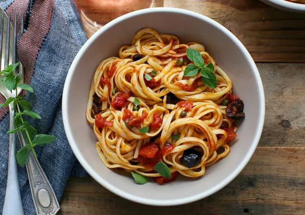

# :spaghetti: Spaghetti Alla Puttanesca

{ loading=lazy }

| :timer_clock: Total Time |
|:-----------------------: |
| 10 minutes |

## :salt: Ingredients

- :bread: 1 16-oz pkg whole wheat spaghetti
- :beans: 2 oz (44 g) sliced black olives
- :leafy_green: 1 14-oz can artichoke hearts
- :beans: 0.75 cup (161 g) cooked chickpeas
- :olive: 2 Tbsp capers
- :tea: 0.5 large minced onion
- :tomato: 1 14-oz can diced tomatoes
- :herb: 1 Tbsp (9 g) dried oregano
- :herb: 1 tsp dried basil
- :herb: 1 tsp (3 g) dried thyme
- :hot_pepper: 0.5 tsp (2 g) red pepper flakes
- :salt: 0.5 tsp (2 g) ground black pepper
- 3 cups [vegetable broth][1]

## :cooking: Cookware

- 1 large, deep skillet

## :pencil: Instructions

### Step 1

Add the whole wheat spaghetti to a large, deep skillet, breaking in half if needed.

### Step 2

Add the sliced black olives, artichoke hearts, cooked chickpeas, capers, minced onion, diced tomatoes, dried oregano,
dried basil, dried thyme, red pepper flakes, and ground black pepper, to the pan on top of the pasta.

### Step 3

Pour the [vegetable broth][1] over everything.

### Step 4

Cover the pan and bring to a boil. Reduce to a steady simmer, and, keeping covered and stirring occasionally.

### Step 5

Cook for 8 to 10 minutes more.

## :link: Source

- Recipe Box

[1]: <../ingredients/vegetable-broth.md>
