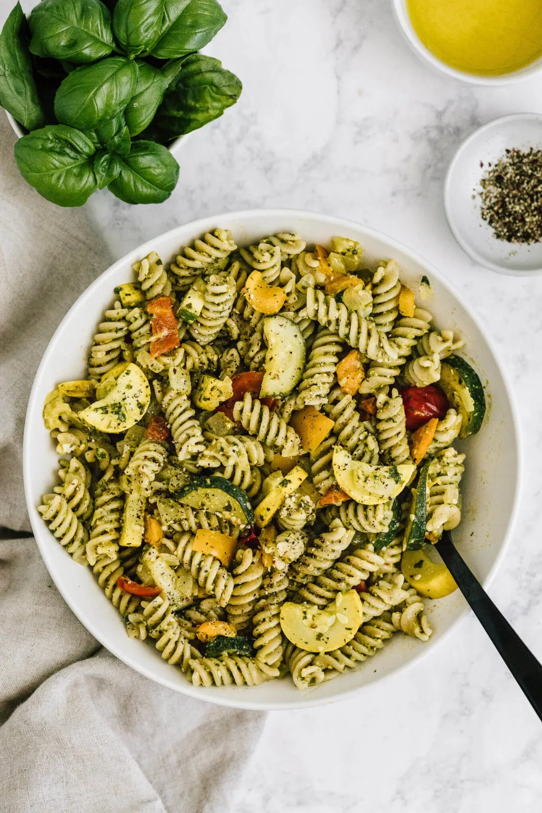

# :spaghetti: Summer Pesto Pasta

{ loading=lazy }

| :fork_and_knife_with_plate: Serves | :timer_clock: Total Time |
|:----------------------------------:|:-----------------------: |
| 8 | 0 minutes |

## :salt: Ingredients

- :bread: 2 ears shucked corn
- :seedling: 1 medium yellow squash
- 1 medium zucchini
- :salt: 1 bell pepper
- :tea: 4 green onions
- :tomato: 1 pint grape tomatoes
- 0.5 cup (62 g) store-bought [pesto][1]
- :tangerine: 1 lemon

## :cooking: Cookware

- 1 grill pan
- 1 bowl

## :pencil: Instructions

### Step 1

Cook pasta according to directions, then drain.

### Step 2

Heat a grill pan and grill shucked corn, yellow squash cut into 1/2-inch thick cubes, zucchini cut into 1/2-inch thick
cubes, and bell pepper cut into sixths. Add green onions and grape tomatoes.

### Step 3

In a separate bowl combine store-bought [pesto][1], zest and juice from 1 lemon.

### Step 4

Mix well, then pour in pasta. Combine veggies into pasta and serve.

## :link: Source

- Recipe Box

[1]: <../sauces-and-dressings/gravy-and-savory-sauces/pesto/joy-of-cooking-pesto.md>
