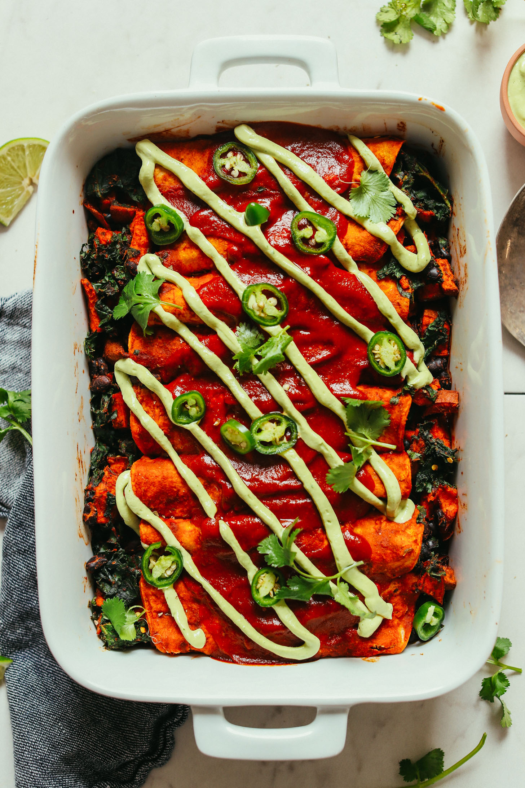

# :stuffed_flatbread: Sweet Potato Black Bean Enchiladas

{ loading=lazy }

| :fork_and_knife_with_plate: Serves | :timer_clock: Total Time |
|:----------------------------------:|:-----------------------: |
| 4 | 60 minutes |

## :salt: Ingredients

- :sweet_potato: 2 lb sweet potatoes
- :olive: 2 Tbsp extra virgin olive oil
- :herb: 1 tsp cumin
- :hot_pepper: 0.5 tsp chili powder
- :salt: 0.25 tsp salt
- :salt: 0.25 tsp black pepper
- :leafy_green: 1 bunch curly kale
- :canned_food: 8 oz can [black beans][1]
- :sauce: 1 cup (225 g) [enchilada sauce][2]
- :cheese_wedge: 1 cup (113 g) shredded cheddar or Monterey jack cheese
- :bread: 8 tortillas
- :avocado: some avocado
- :herb: some cilantro

## :cooking: Cookware

- 1 rimmed baking sheet
- 1 9x13-inch baking dish
- 1 mixing bowl

## :pencil: Instructions

### Step 1

Preheat the oven to 400°F (200°C). Peel and dice the sweet potatoes into 1/2-inch cubes.

### Step 2

Toss the sweet potatoes with olive oil, cumin, chili powder, salt, and pepper on a rimmed baking sheet. Roast for 20 to
25 minutes until tender.

### Step 3

While the sweet potatoes are roasting, remove the stems from the kale and finely chop the leaves. Steam the kale for 5
minutes until tender.

### Step 4

Alternatively, sweet onion (optional), about 5 minutes. Also, add [black beans][1] to the pot and garlic (optional) right
before the kale.

### Step 5

Add drained [black beans][1] to a mixing bowl with steamed kale and roasted sweet potatoes. Add the smaller measurement of
[enchilada sauce][2] to the kale and sweet potatoes and stir to combine.

### Step 6

Pour 1/4 cup of the [enchilada sauce][2] into the bottom of a 9x13-inch baking dish.

### Step 7

Warm the tortillas in the microwave for 30 seconds until pliable.

### Step 8

Fill each tortilla with about 1/3 cup of the sweet potato mixture. Roll up the tortillas and place them seam-side down in
the baking dish.

### Step 9

Pour the remaining [enchilada sauce][2] over the top of the enchiladas and sprinkle with cheese.

### Step 10

Bake for 15 to 20 minutes until the cheese is melted and bubbling.

### Step 11

Serve with avocado and fresh cilantro.

## :link: Source

- <https://cookieandkate.com/sweet-potato-black-bean-enchiladas/>

[1]: <../ingredients/black-beans.md>
[2]: <../sauces-and-dressings/gravy-and-savory-sauces/enchilada-sauce.md>
