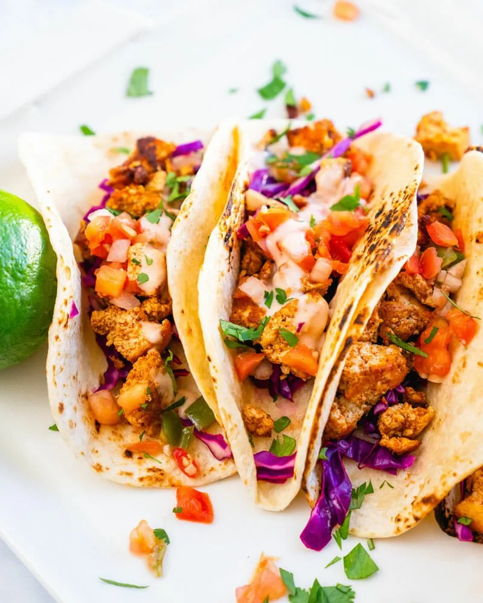

# :taco: Tofu Tacos

{ loading=lazy }

| :timer_clock: Total Time |
|:-----------------------: |
| 40 minutes |

## :salt: Ingredients

- :cheese_wedge: 16 oz extra firm tofu
- :olive: 1 Tbsp (12 g) olive oil
- 2 Tbsp [soy sauce][1]
- 2 Tbsp [Tomato Paste](../ingredients/tomato-paste.md)
- :honey_pot: 1 Tbsp (20 g) maple syrup
- :chestnut: 1 tsp (2 g) onion powder
- :garlic: 1 tsp garlic powder
- :hot_pepper: 1 tsp smoked paprika
- :hot_pepper: 2 tsp (4 g) chili powder
- :chestnut: 1 tsp (3 g) cumin

## :cooking: Cookware

- :cookie: 1 baking sheet
- 1 silicon mat
- :bowl_with_spoon: 1 large bowl
- :knife: 1 fork
- :spoon: 1 spatula

## :pencil: Instructions

### Step 1

Preheat oven to 350°F.

### Step 2

Line a baking sheet with a silicon mat.

### Step 3

In a large bowl, mash patted dry extra firm tofu with a fork.

### Step 4

Mix olive oil, soy sauce, [Tomato Paste](../ingredients/tomato-paste.md), maple syrup, onion powder, garlic powder, smoked paprika, chili powder, and
cumin.

### Step 5

Spread tofu mixture on silicon mat.

### Step 6

Bake for 20 minutes, then stir/flip with a spatula. Bake for 20 minutes more.

## :link: Source

- Recipe Box

[1]: <../ingredients/mock-soy-sauce.md>
