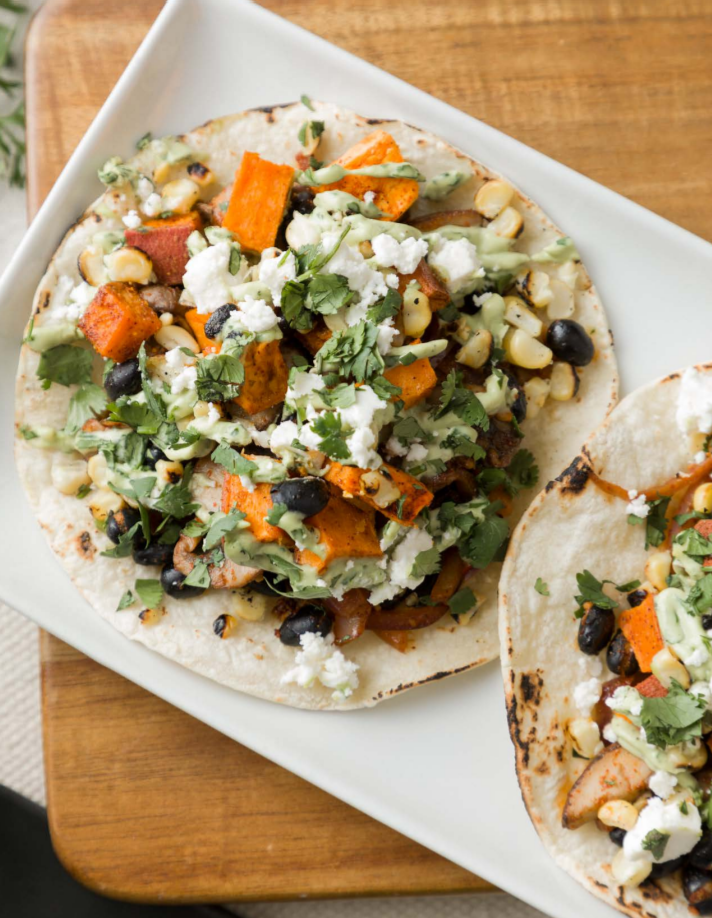

# :taco: Vegetarian Tacos

{ loading=lazy }

| :fork_and_knife_with_plate: Serves | :timer_clock: Total Time |
|:----------------------------------:|:-----------------------: |
| 8 | 30 minutes |

## :salt: Ingredients

=== "Taco"

    - :olive: some olive oil
    - :cupcake: 2 chopped sweet potatoes, 1 inch diced
    - :hot_pepper: 1 Tbsp (7 g) chili powder
    - :chestnut: 1 tsp (3 g) cumin
    - :salt: some salt
    - :salt: some pepper
    - :mushroom: 8 oz (78 g) mushrooms, thinly sliced
    - :beans: 0.5 red onions, sliced
    - :candy: 2 ears sweet corn
    - :garlic: 1 Tbsp garlic
    - :apple: 1 can [black beans][1], drained
    - :flatbread: 8 corn or TJ's Jicama tortillas
    - :cheese_wedge: some feta cheese (optional)
    - :apple: some cilantro (optional)

=== "Avocado Crema"

    - :avocado: 1 ripe avocado
    - :coconut: 0.33 cup (75 g) full fat, plain Greek yogurt
    - :herb: 0.25 cup (10 g) cilantro
    - :tangerine: 1 Tbsp (14 g) lime juice
    - :salt: some salt
    - :salt: some pepper

## :cooking: Cookware

- :cookie: 1 large baking sheet
- 1 sauté pan
- :bowl_with_spoon: 1 small bowl

## :pencil: Instructions

### Step 1

Preheat oven to 400°F.

### Step 2

On a large baking sheet, drizzle 1/2 teaspoon olive oil on chopped sweet potatoes, 1 inch diced. Add chili powder,
cumin, salt, pepper, and evenly distribute the seasonings over the sweet potatoes. Bake for 25 to 30 minutes or until
the sweet potatoes are roasted and slightly browned.

### Step 3

Meanwhile, drizzle 1 to 2 Tbsp of olive oil to coat the bottom of a sauté pan and bring to a medium heat. Add
mushrooms, thinly sliced, red onions, sliced, sweet corn and minced garlic. Once vegetables are slightly browned, add
the drained [black beans][1], drained, and turn heat to low. Simmer until the sweet potatoes are done cooking in the oven.

### Step 4

Make the avocado crema by whipping ripe avocado, full fat, plain Greek yogurt, cilantro, lime juice, salt, and pepper in
a small bowl.

### Step 5

Warm up corn or TJ's Jicama tortillas on stovetop. Assemble tacos by layering sweet potatoes, then sauteed vegetables,
avocado crema and a sprinkle of feta cheese (optional) and cilantro (optional) on a warm tortilla.

## :link: Source

- Applied Kitchen

[1]: <../ingredients/black-beans.md>
