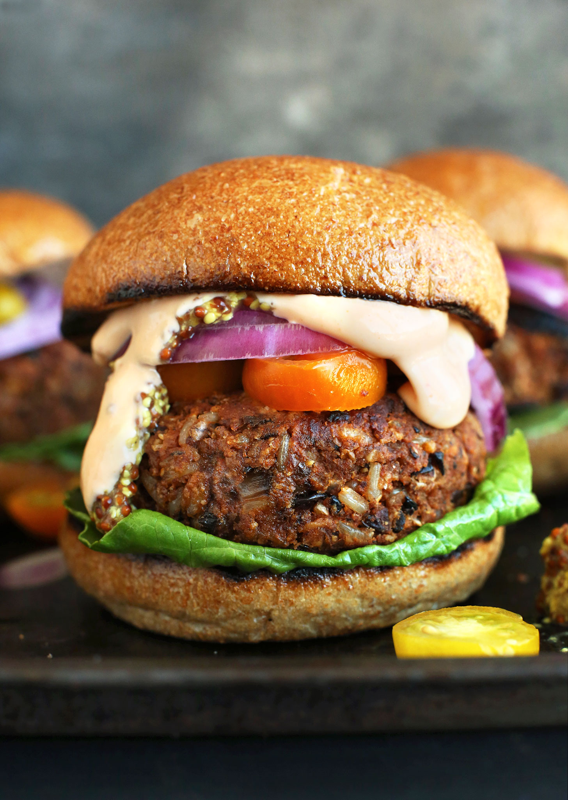

# :hamburger: Veggie Burgers

{ loading=lazy }

| :fork_and_knife_with_plate: Serves | :timer_clock: Total Time |
|:----------------------------------:|:-----------------------: |
| 4 burgers | 45 minutes |

## :salt: Ingredients

- :beans: 1.5 cups (260 g) [dried black beans][1]
- :ear_of_rice: 0.5 cup (93 g) cooked brown rice
- :onion: 0.5 cup (80 g) chopped onion
- :hot_pepper: 0.5 cup (80 g) chopped bell pepper
- :garlic: 2 cloves garlic
- :herb: 1 tsp ground cumin
- :hot_pepper: 1 tsp chili powder
- :salt: 0.5 tsp salt
- :salt: 0.25 tsp black pepper
- :bread: 0.5 cup (60 g) breadcrumbs
- :egg: 1 large egg
- :olive: 1 Tbsp extra virgin olive oil

## :cooking: Cookware

- 1 large mixing bowl
- 1 fork
- 1 large skillet

## :pencil: Instructions

### Step 1

To a large mixing bowl, add drained, [dried black beans][1] and mash well with a fork, leaving only a few whole beans.

### Step 2

Add cooked brown rice, onion, bell pepper, garlic, cumin, chili powder, salt, and pepper. Mix well.

### Step 3

Add breadcrumbs and egg. Mix until everything is well combined and the mixture can be formed into patties.

### Step 4

Form the mixture into 4 patties.

### Step 5

Heat olive oil in a large skillet over medium heat. Cook the patties for 4 to 5 minutes per side until browned and heated
through.

### Step 6

Serve on buns with your favorite toppings.

## :link: Source

- <https://minimalistbaker.com/the-best-vegan-veggie-burger/>

[1]: <../ingredients/black-beans.md>
