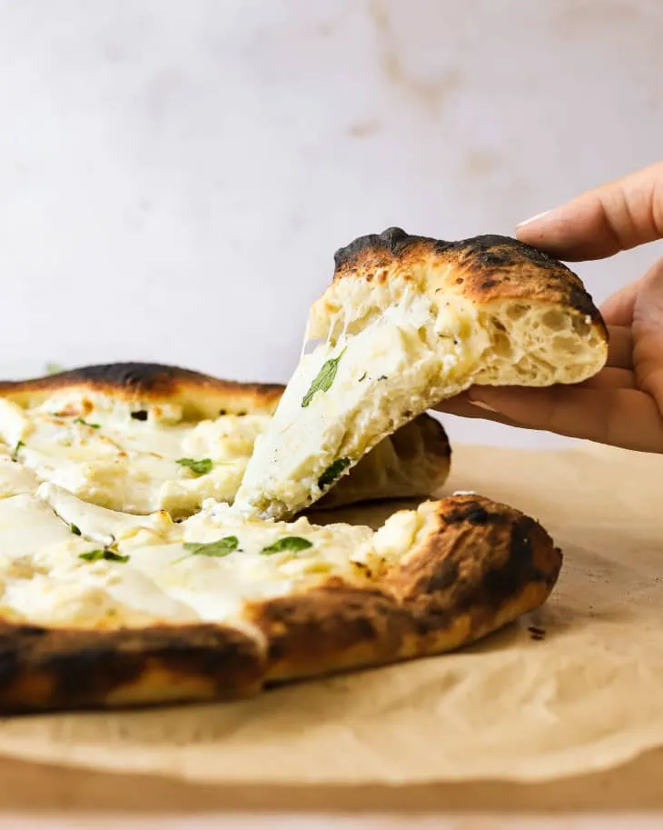

# :pizza: White Pizza

{ loading=lazy }

| :timer_clock: Total Time |
|:-----------------------: |
| 2.25 hours |

## :salt: Ingredients

- 1 [pizza dough][1]
- :cheese_wedge: 8 oz (113 g) mozzarella cheese
- :glass_of_milk: 1 cup (100 g) whole-milk [ricotta cheese](../ingredients/ricotta.md)
- :cheese_wedge: 1 oz (14 g) Pecorino Romano cheese
- :garlic: 1 clove garlic
- :olive: 2 Tbsp (25 g) olive oil
- :salt: 0.25 tsp kosher salt
- :hot_pepper: 0.25 tsp (1 g) red pepper flakes
- :herb: 3 sprigs fresh oregano

## :cooking: Cookware

- :bowl_with_spoon: 1 small bowl

## :pencil: Instructions

### Step 1

If using store-bought [pizza dough][1], divide into 2 pieces. If the dough is cold, let sit at room temperature at
least 2 hours before proceeding. The dough is ready when it does not bounce back when stretched.

### Step 2

Pat and gently squeeze 8 ounces fresh mozzarella cheese dry with paper towels if water packed. Thinly slice. Place 1 cup
whole-milk [ricotta cheese](../ingredients/ricotta.md) in a small bowl. Finely grate 1 ounce Pecorino Romano cheese (about 1/2 packed cup) or measure
out 1/3 cup store-bought grated, add it to the bowl of [Ricotta](../ingredients/ricotta.md), and stir to combine.

### Step 3

Finely chop 1 large garlic clove and place in a small bowl. Add 2 tablespoons olive oil, 1/4 teaspoon kosher salt, and
1/4 teaspoon red pepper flakes if desired. Stir to combine. Pick the leaves from 3 small fresh oregano sprigs and set
aside for garnish.

### Step 4

Heat a pizza oven to 800ºF. Stretch or roll out one portion of dough on a lightly floured pizza peel into a rough 11 to
12 inch round. Brush the dough round with 1 tablespoon of the garlic oil. Top evenly with half of the mozzarella and
dollop all over with half of the [Ricotta](../ingredients/ricotta.md) mixture.

### Step 5

Use the peel to slide the pizza into the pizza oven. Bake until the bottom is charred in a few spots and the cheese on
top is melted (you may have to turn the heat down if the crust is charring too quickly), rotating a few times for even
cooking, 2.5 to 3 minutes total. Transfer to a cutting board and repeat with the remaining dough round. Scatter the
oregano leaves over the top. Garnish with more red pepper flakes if desired.

### Step 6

Place an upside-down baking sheet or pizza stone on the middle rack and heat the oven to 450ºF. Stretch or roll out one
portion of dough on a sheet of parchment paper into a rough 11 to 12-inch round. Brush the dough round with 1 tablespoon
of the garlic oil. Top evenly with half of the mozzarella and dollop all over with half of the [Ricotta](../ingredients/ricotta.md) mixture.

### Step 7

Slide, still on the parchment, onto the hot baking sheet or stone. Bake until the edges are golden-brown and the cheese
on top is melted, 10 to 12 minutes. Transfer to a cutting board and repeat with the remaining dough round. Scatter the
oregano leaves over the top. Garnish with more red pepper flakes if desired.

## :link: Source

- <https://www.thekitchn.com/white-pizza-23411738>

[1]: <../ingredients/pizza-dough.md>
