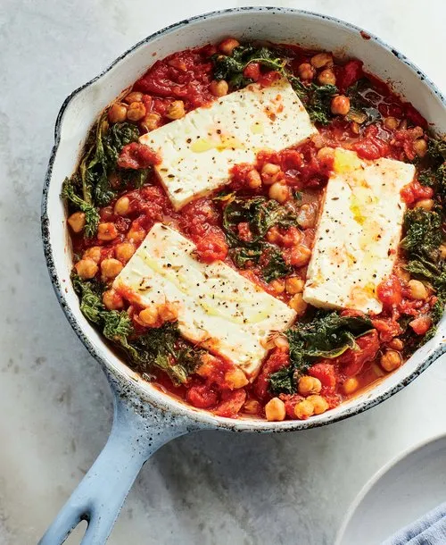

# :cheese_wedge: Baked Feta with Chickpeas & Kale

{ loading=lazy }

| :fork_and_knife_with_plate: Serves | :timer_clock: Total Time |
|:----------------------------------:|:-----------------------: |
| 4 | 17 minutes |

## :salt: Ingredients

- :olive: 2 Tbsp (25 g) olive oil
- :chestnut: 1 tsp (3 g) cumin
- :leafy_green: 1 bunch kale
- :tomato: 2 cups marinara
- :beans: 1.5 cups (322 g) cooked chickpeas
- :tangerine: 1 Tbsp (14 g) lemon juice
- :droplet: 0.5 cup (114 g) water
- :glass_of_milk: 1 12-oz block feta
- :salt: some pepper
- :hot_pepper: 1 pinch red pepper flakes
- :bread: some [pita][1] or baguette
- :tangerine: some lemon wedges

## :cooking: Cookware

- 1 10-inch skillet

## :pencil: Instructions

### Step 1

Preheat oven to 350°F. Heat 10-inch skillet and add olive oil. Add cumin and sizzle for 1 to 2 minutes.

### Step 2

Add kale, with stems removed and torn into pieces, in batches; letting each handful shrink and wilt before adding the
next.

### Step 3

When the last of the kale has wilted, add marinara, cooked chickpeas, lemon juice, and 1/2 cup water. Stir to let come
to a simmer.

### Step 4

Nestle the feta slices into the sauce and sprinkle with pepper. Bake until feta has softened, about 15 minutes.

### Step 5

Drizzle with olive oil and a pinch of red pepper flakes.

### Step 6

Serve warm with [pita][1] or baguette and lemon wedges.

## :link: Source

- Recipe Box

[1]: <../breads/pita.md>
