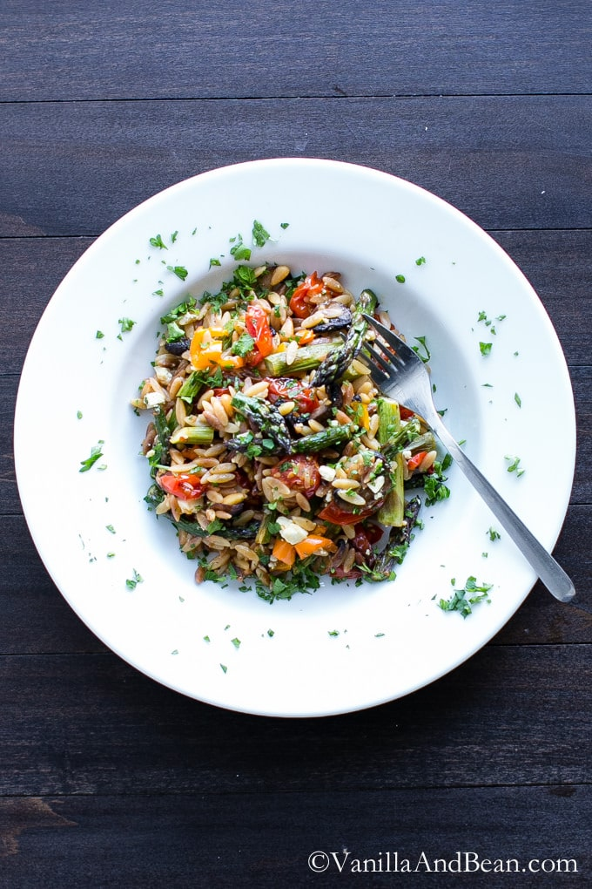

# :rice: Lemon Garlic Orzo with Roasted Veggies

{ loading=lazy }

| :fork_and_knife_with_plate: Serves | :timer_clock: Total Time |
|:----------------------------------:|:-----------------------: |
| 4 | 1.08 hours |

## :salt: Ingredients

- :mushroom: 1.5 cups (117 g) cremini mushrooms
- :hot_pepper: 1 cup (142 g) bell peppers
- 1 lb asparagus
- :apple: 12 oz (504 g) cherry tomatoes
- :garlic: 2 tsp garlic
- :garlic: 0.5 cup shallot
- :olive: 2 Tbsp (25 g) olive oil
- :salt: some salt
- :salt: some pepper
- :ear_of_rice: 1 cup (200 g) orzo
- :olive: 1 Tbsp (12 g) olive oil
- 1.5 cups [vegetable broth][1]
- :olive: 2 Tbsp (25 g) olive oil
- :tangerine: 1 Tbsp (14 g) lemon juice
- :salt: 0.5 tsp salt
- :salt: 0.25 tsp pepper
- :cheese_wedge: 0.5 cup (57 g) crumbled feta
- :chestnut: 0.33 cup (47 g) pine nuts
- :herb: some basil

## :cooking: Cookware

- 1 roasting pan

## :pencil: Instructions

### Step 1

Preheat oven to 350°F, and toast pine nuts for 6 to 7 minutes. Set aside to cool.

### Step 2

Turn up oven to 425°F. Place sliced cremini mushrooms, bell peppers, asparagus, cherry tomatoes, garlic, and shallot on
a roasting pan.

### Step 3

Sprinkle with 2 Tbsp olive oil, and salt, and pepper. Roast at 425°F for 35 to 40 minutes, rotating pan halfway
through.

### Step 4

To cook orzo, sauté 1 Tbsp olive oil until shimmering. Add orzo and stir, coating thoroughly. Stir occasionally for
about 3 minutes or until golden.

### Step 5

Add [Vegetable Broth](../ingredients/vegetable-broth.md). Bring to a simmer, turn down heat to low, cover and cook for 15 minutes. Remove from heat. Cover
and set aside.

### Step 6

To make dressing, add olive oil, lemon juice, salt and pepper and mix until emulsified.

### Step 7

Mix together vegetables, orzo, dressing, crumbled feta, and pine nuts. Garnish with basil or parsley, if desired.

## :link: Source

- Recipe Box

[1]: <../ingredients/vegetable-broth.md>
