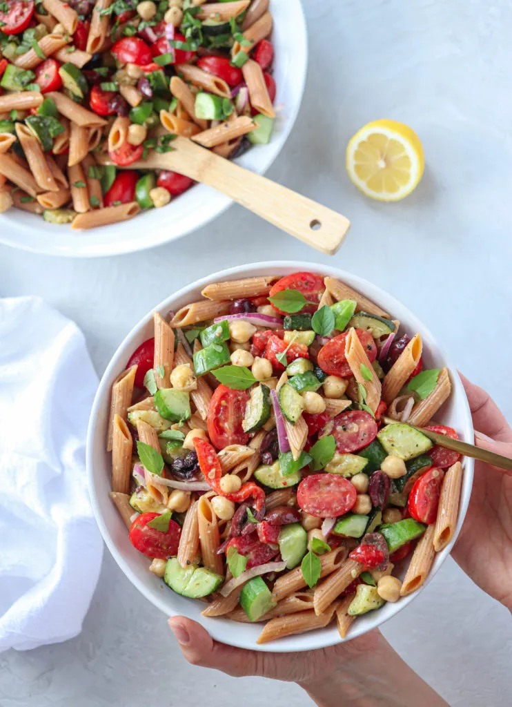

# :green_salad: Mediterranean Pasta Salad

{ loading=lazy }

| :timer_clock: Total Time |
|:-----------------------: |
| 3 minutes |

## :salt: Ingredients

- :wine_glass: 0.5 lb red lentil pasta
- :olive: 1 Tbsp (12 g) olive oil
- :tea: 0.5 red onion
- :chestnut: 2 Tbsp (18 g) pine nuts
- :tomato: 2 tomatoes
- :hot_pepper: 1 jar [Roasted Red Peppers](../ingredients/roasted-red-peppers.md)
- :cucumber: 1 cucumber
- :olive: 1 cup (142 g) pitted olives
- :olive: 1 Tbsp capers
- :apple: 1 can kidney beans
- :herb: 1 handful basil
- :herb: 1 handful parsley
- :wine_glass: 2 Tbsp (26 g) red wine vinegar
- :salt: 1 tsp pepper
- :garlic: 3 cloves garlic

## :cooking: Cookware

- 1 sauté pan
- :bowl_with_spoon: 1 mixing bowl

## :pencil: Instructions

### Step 1

Cook red lentil pasta according to directions. Drain and rinse with cold water.

### Step 2

Heat sauté pan on medium-high heat. Add olive oil, diced red onion, and pine nuts; sauté for 2 minutes.

### Step 3

Chop tomatoes into medium-large pieces, then add to sauté pan and cook for 1 minute, or until onions are translucent
and pine nuts begin to brown.

### Step 4

Remove from heat. In a large mixing bowl, add cooked pasta, sautéed mixture, [Roasted Red Peppers](../ingredients/roasted-red-peppers.md), diced cucumber,
pitted olives, capers, kidney beans, basil, parsley, red wine vinegar, pepper, and garlic; gently toss to mix well.

!!! tip "Options"

    Can add pesto, tempeh, tofu, spinach, green onion, or any other vegetable that can be eaten raw.

## :link: Source

- Recipe Box
