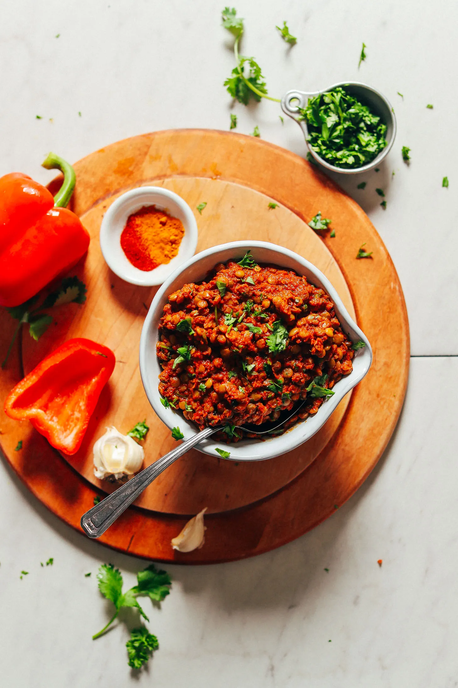

# :curry: Saucy Moroccan-Spiced Lentils

{ loading=lazy }

| :timer_clock: Total Time |
|:-----------------------: |
| 20 minutes |

## :salt: Ingredients

- :beans: 1 cup (210 g) lentils
- :droplet: 2 cup (454 g) water
- :garlic: 3 cloves garlic
- :tea: 1 medium onion
- :hot_pepper: 1 large bell pepper
- 2 Tbsp [Tomato Paste](../ingredients/tomato-paste.md)
- :candy: 2 Tbsp (19 g) coconut sugar
- :salt: 0.5 tsp sea salt
- :candy: 1 Tbsp paprika
- :chestnut: 1 tsp (3 g) cumin
- :chestnut: 0.5 tsp (1 g) coriander
- :sweet_potato: 1 tsp (3 g) ginger
- :curry: 0.5 tsp (2 g) turmeric
- :hot_pepper: 0.5 tsp cayenne pepper
- :apple: 2 Tbsp (35 g) apple cider vinegar
- :apple: 0.75 cup (32 g) parsley or cilantro

## :cooking: Cookware

- :gear: 1 food processor

## :pencil: Instructions

### Step 1

Cook lentils first by bringing water to a boil and adding lentils. Bring back to a boil. Then reduce heat to low and
simmer (uncovered) for about 20 minutes or until lentils are tender.

### Step 2

In the meantime, to a food processor or small blender, add garlic*, onion or shallot*, bell pepper, [Tomato Paste](../ingredients/tomato-paste.md),
coconut sugar, sea salt, paprika, cumin, coriander, ginger, turmeric, cayenne pepper, and apple cider vinegar. Mix to
thoroughly combine.

### Step 3

Taste and adjust flavor as needed, adding more [Tomato Paste](../ingredients/tomato-paste.md) for depth of flavor, spices for more overall flavor
(especially coriander and paprika), cayenne for heat, coconut sugar for sweetness, apple cider vinegar for acidity, or
salt for saltiness. Set aside.

### Step 4

Once the lentils have cooked, drain off any excess liquid and then add spice mixture and parsley or cilantro and mix
well to combine.

### Step 5

Enjoy immediately with salads, rice (or cauliflower rice), bowls, and more. Store leftovers in the refrigerator up to
4-5 days or in the freezer up to 1 month.

## :link: Sources

- <https://minimalistbaker.com/saucy-moroccan-spiced-lentils/>
- Recipe Box
