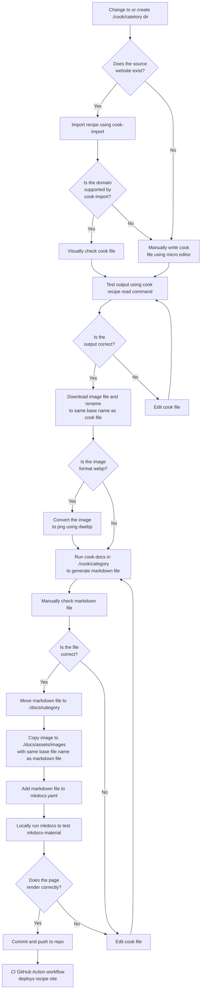

# :gear: Development

## :smiley: Emoji

Emoji are manually added to the front of ingredients and cookware to give the pages a little bit of flare. My hopes is
that eventually this can be added to `cook-docs` as an automated task. For now, `emoji.yaml` can be used as reference.

```yaml title="emoji.yaml"
--8<-- "includes/emoji.yaml"
```

## :runner: Workflow

Below is my current workflow for documenting recipes.



## :hammer_and_wrench: Tools

Tools used to develop this repository.

!!! note
    All commands are run from the root of the repo unless otherwise specified.

### :rice: [`cooklang`][2]

Used to generate shopping lists and manage recipes.

```shell title="Installation"
brew tap cooklang/tap
brew install cooklang/tap/cook
```

```shell title="Usage"
cook recipe read file.cook
```

### :frame_with_picture: [`webp`][1]

Used to convert images from `webp` to `png`.

```shell title="Installation"
sudo apt install webp
```

```shell title="Usage"
dwebp file.webp -o file.png
```

### :robot: [Task][8]

Used to automate tasks.

```shell title="Installation"
brew install go-task/tap/go-task
```

```shell title="Usage"
# List tasks
task
```

### :page_with_curl: [`cook-docs`][3]

Used to generate markdown files from cooklang files.

```shell title="Installation"
brew install nicholaswilde/tap/cook-docs
```

```shell title="Usage"
/recipes/cook/category$ cook-docs
```

### :book: [Material for MkDocs][6]

Used as theme for static site.

```shell title="Installation"
pip install mkdocs-material mkdocs-minify-plugin
```

### :book: [MkDocs][7]

Used to generate static site.

```shell title="Installation"
(
  wget https://bootstrap.pypa.io/get-pip.py
  python get-pip.py
  pip install mkdocs
)
```

=== "Task"

    ```shell title="Usage"
    task serve
    ```

=== "Manual"

    ```shell title="Usage"
    mkdocs serve
    ```

### :abc: [Spellchecker CLI][9]

Used to check documentation spelling.

```shell title="Installation"
npm install --global spellchecker-cli
```

=== "Task"

    ```shell title="Usage"
    task spellcheck
    ```

=== "Script"

    ```shell title="Usage"
    chmod +x ./scripts/spellcheck.sh
    ./scripts/spellcheck.sh
    ```

=== "Manual"

    ```shell title="Usage"
    npx spellchecker -d dictionary.txt -f {"./cook/**/*.cook","./docs/**/*.md"}
    ```

```shell title="Add to dictionary"
echo "word to add" >> dictionary.txt
```

=== "Task"

    ```shell title="Sort dictionary"
    task sort
    ```
=== "Manual"

    ```shell title="Sort dictionary"
    sort dictionary.txt -u -o dictionary.txt
    ```

### :link: [markdown-link-check][10]

Used to check documentation links.

```shell title="Installation"
npm install -g markdown-link-check
```

=== "Task"

    ```shell title="Usage"
    task linkcheck
    ```

=== "Script"

    ```shell title="Usage"
    chmod +x ./scripts/linkcheck.sh
    ./scripts/linkcheck.sh
    ```

=== "Docker"

    ```shell title="Usage"
    docker run --rm -v /:/tmp:ro -i -w /tmp ghcr.io/tcort/markdown-link-check:stable "/tmp/path/to/file" -c "/tmp{{ .ROOT_DIR }}/mlc_config.json"
    ```

### [Emojipedia][4]

Website used to search for emoji shortcodes.

### [Emoji Combos][5]

Website used to search for emoji contexts.

[1]: <https://developers.google.com/speed/webp/docs/precompiled>
[2]: <https://cooklang.org/>
[3]: <https://nicholaswilde.io/cook-docs/>
[4]: <https://emojipedia.org/>
[5]: <https://emojicombos.com/>
[6]: <https://squidfunk.github.io/mkdocs-material/>
[7]: <https://www.mkdocs.org/>
[8]: <https://taskfile.dev/>
[9]: <https://github.com/tbroadley/spellchecker-cli>
[10]: <https://github.com/tcort/markdown-link-check>
