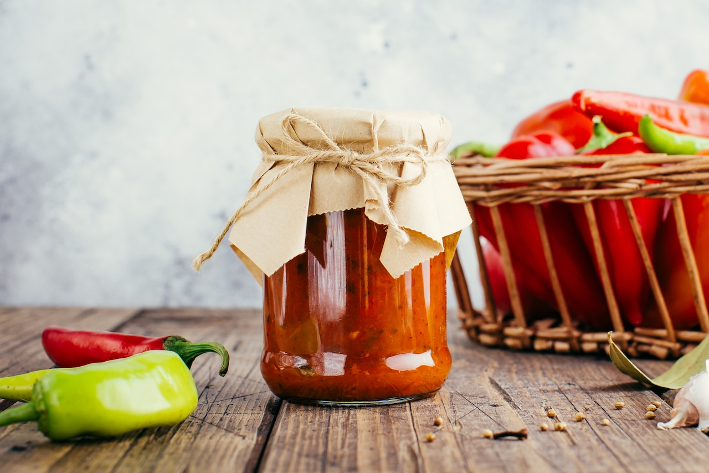

# :hot_pepper: Chilero Hot Sauce

| :timer_clock: Total Time |
|:-----------------------: |
| 20 minutes |

## :salt: Ingredients

| :fork_and_knife_with_plate: Serves  |
|:-----------------------------------:|
| 3                                   |

- :carrot: 0.25 carrots
- :onion: 0.5 small sweet onions
- :cucumber: 0.25 cucumbers
- :broccoli: 0.125 head cauliflower
- :bell_pepper: 0.5 read or green bell peppers
- :hot_pepper: 0.75 jalapeno peppers
- :hot_pepper: 1 spicy chili peppers (like habanero)
- :salt: 0.5 tsp salt
- :champagne: 3 oz white vinegar

| :fork_and_knife_with_plate: Serves  |
|:-----------------------------------:|
| 24                                  |

- :carrot: 2 carrots
- :onion: 4 small sweet onions
- :cucumber: 2 cucumbers
- :broccoli: 1 head cauliflower
- :bell_pepper: 4 read or green bell peppers
- :hot_pepper: 6 jalapeno peppers
- :hot_pepper: 8 spicy chili peppers (like habanero)
- :salt: 1 Tbsp salt
- :champagne: 24 oz white vinegar

## :cooking: Cookware

- 1 wide-mouth glass pickling bottles(s) or jar(s)

## :pencil: Instructions

### Step 1

Quickly parboil carrots and sweet onions by boiling water and dropping them in for 1 to 2 minutes, until their color
turns bright. Drain and pat dry.

### Step 2

Sprinkle cucumbers, cauliflower, read or green bell peppers, jalapeno peppers, and spicy chili peppers (like habanero)
with salt.

### Step 3

Fill clean wide-mouth glass pickling bottles(s) or jar(s) with vegetables, then pour white vinegar into bottles, pushing
down vegetables until vinegar covers them entirely.

### Step 4

Allow the chilero to sit at room temperature (not in the sun) for at least a day before using. Two or three days is
better.

### Step 5

Store for 2 to 3 months in the refrigerator.

## :link: Source

- The Blue Zones Kitchen
