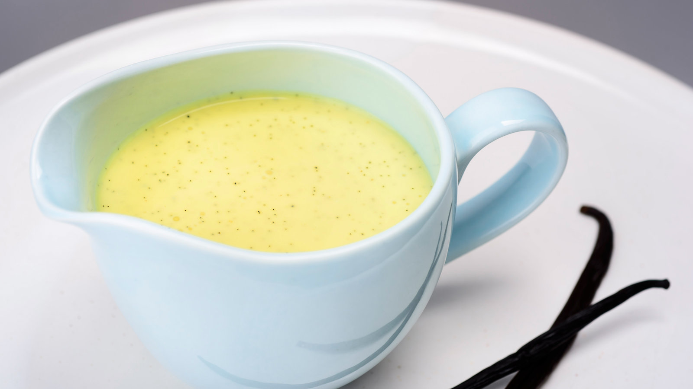

# :egg: Crème Anglaise

{ loading=lazy }

| :fork_and_knife_with_plate: Serves | :timer_clock: Total Time |
|:----------------------------------:|:-----------------------: |
| 6 | 4 minutes |

## :salt: Ingredients

- :glass_of_milk: 200 ml whole milk
- :icecream: 100 ml heavy cream
- :icecream: 0.25 tsp [vanilla paste][1]
- :egg: 3 large egg yolks
- :candy: 40 g granulated sugar

## :cooking: Cookware

- 1 small pan
- 1 medium bowl
- 1 heavy-based pan
- 1 spoon
- 1 clingfilm
- 1 sieve

## :pencil: Instructions

### Step 1

Pour the whole milk and heavy cream into a small pan over a low heat. Add the [vanilla paste][1] and bring slowly to a
simmer.

### Step 2

In a medium bowl, whisk the egg yolks and granulated sugar together until pale to blanch it and get some type of a
paste. Pour some the warm milk through a sieve into the mixture, whisking gently and continuously. Pour the rest of the
milk into the mixture and whisk. Sieve into a clean, heavy-based pan and cook over a very low heat.

### Step 3

Simmer the mixture gently for 3 to 4 minutes, stirring continuously, until smooth and thick enough to coat the back of a
spoon. When cooked, the temperature should get to 80°C (176°F). Or once the foam starts to disappear from the top of
the mixture.

### Step 4

Remove from the heat, put through a sieve and then into a clean bowl and cover the surface with clingfilm to prevent a
skin forming, then leave to cool.

## :link: Sources

- <https://thegreatbritishbakeoff.co.uk/recipes/all/prue-leith-snow-eggs/>
- <https://www.youtube.com/watch?v=q8uS3VI86-w>

[1]: <../reference/equivalents-and-substitutes.md#vanilla>
