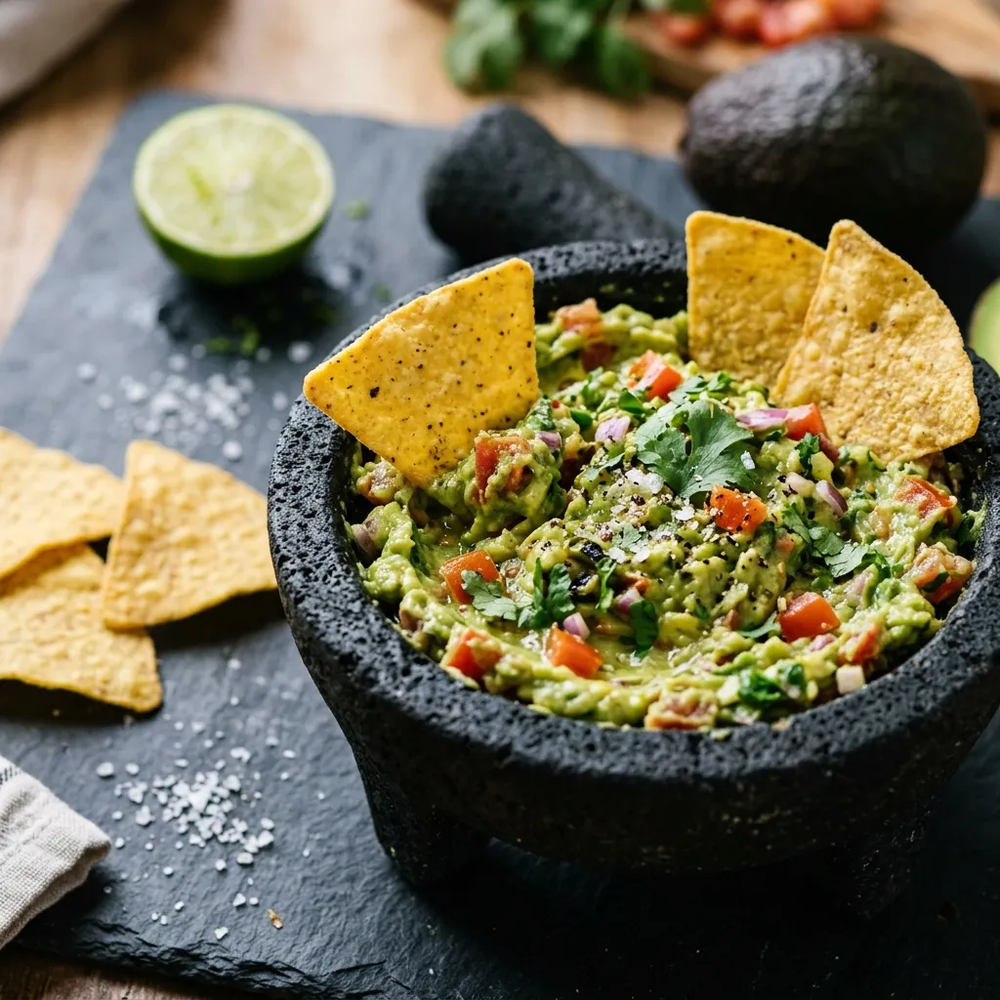

# :avocado: Applied Kitchen Guacamole

{ loading=lazy }

| :fork_and_knife_with_plate: Serves | :timer_clock: Total Time |
|:----------------------------------:|:-----------------------: |
| 3 cups | 20 minutes |

## :salt: Ingredients

- :hot_pepper: 1 each jalapeño
- :avocado: 3 each ripe avocados
- :tomato: 1 each small tomato
- :tea: 0.5 each red onion
- :apple: 1 each lemon or lime
- :herb: 2 Tbsp (5 g) cilantro
- :salt: some kosher salt
- :hot_pepper: some cracked black pepper
- :bread: some tortilla chips

## :cooking: Cookware

- 1 tongs
- 1 plastic bag
- 1 mixing bowl
- 1 spoon
- 1 fork
- 1 plastic wrap

## :pencil: Instructions

### Step 1

Using tongs, roast the jalapeño over a high gas flame, turning frequently until all sides are evenly charred and
blackened, about 3 minutes. Transfer the pepper to a plastic bag and let it steam for 5 minutes. Once cooled, peel off
and discard the skin. Slice the jalapeño open, remove the seeds, and mince into a paste.

### Step 2

Slice the ripe avocados in half lengthwise. Remove the pits carefully, then scoop the flesh into a mixing bowl using a
spoon, taking about 4 minutes.

### Step 3

Add to the bowl: diced small tomato, finely chopped red onion, minced roasted jalapeño, freshly squeezed lemon or lime
(juiced), chopped fresh cilantro, and kosher salt and cracked black pepper, taking about 3 minutes.

### Step 4

Use a fork to mash the avocado while mixing in the other ingredients, about 3 minutes. Mash until you reach your desired
consistency - chunky or smooth.

### Step 5

Taste the guacamole and adjust seasoning as needed. Add more salt, pepper, lemon/lime juice, or jalapeño to suit your
taste, taking about 2 minutes.

### Step 6

Serve with tortilla chips or as a topping. If not serving right away, cover tightly with plastic wrap pressed directly
onto the surface of the guacamole to minimize browning, and refrigerate for up to 2 days.

## :link: Source

- Applied Kitchen
