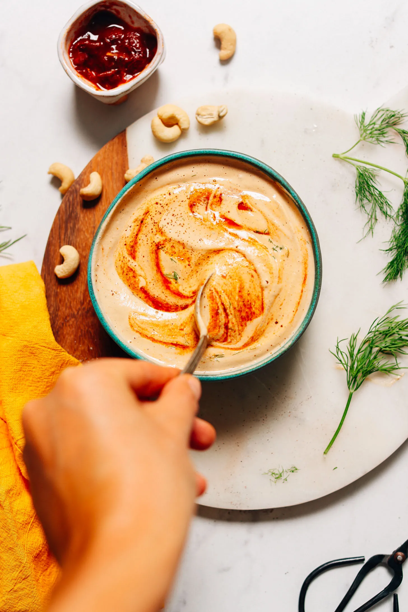

# :green_salad: Cashew Chipotle Ranch Dressing

{ loading=lazy }

| :timer_clock: Total Time |
|:-----------------------: |
| 60 minutes |

## :salt: Ingredients

- :chestnut: 1 cup (113 g) raw cashews
- :glass_of_milk: 0.67 cup (56 g) almond milk
- :tangerine: 2 tsp lemon or lime juice
- :garlic: 1 clove garlic
- :salt: 0.5 tsp salt
- :chestnut: 0.25 tsp (1 g) onion powder
- :apple: 1 tsp (6 g) apple cider vinegar
- :honey_pot: 1 tsp (6 g) maple syrup
- :hot_pepper: 0.25 tsp (1 g) chipotle chili powder or sub chili powder
- :herb: 1 Tbsp (9 g) dried dill

## :cooking: Cookware

- 1 immersion blender

## :pencil: Instructions

### Step 1

Soak raw cashews in hot water for 30 minutes. Mix almond mil and lemon juice. Set aside for 30 minutes.

### Step 2

Using immersion blender, mix drained cashews and almond milk, lemon or lime juice, garlic, salt, onion powder, apple
cider vinegar, maple syrup, chipotle chili powder or sub chili powder, and dried dill.

## :link: Source

- <https://minimalistbaker.com/vegan-chipotle-ranch-dressing/#wprm-recipe-container-45694>
