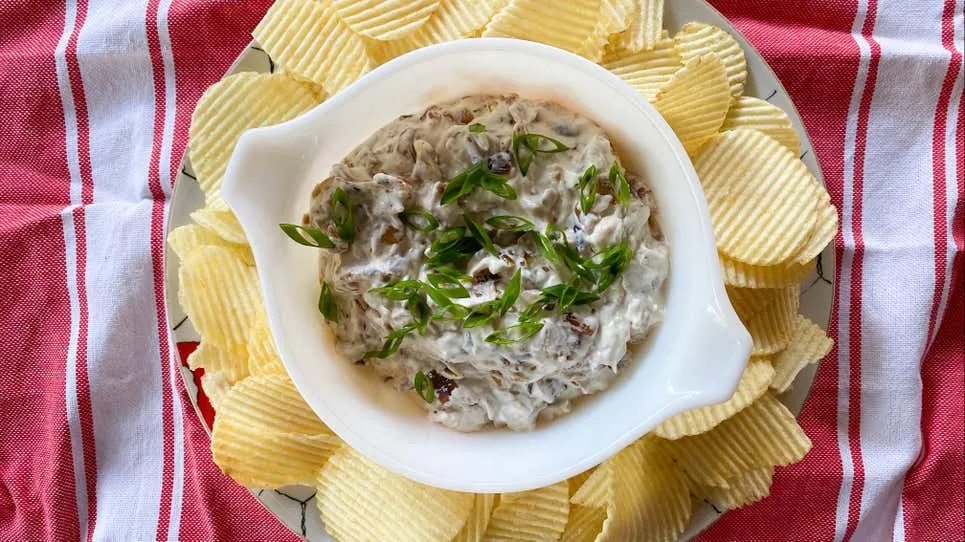

# :onion: Claire's Five-Onion Dip

{ loading=lazy }

| :timer_clock: Total Time |
|:-----------------------: |
| 60 minutes |

## :salt: Ingredients

- :tea: 1 white onion
- :tea: 1 red onion
- :tea: 1 sweet onion
- :garlic: 2 shallot
- :olive: 0.5 cup (99 g) vegetable oil
- :salt: 1 Tbsp salt
- :glass_of_milk: 1 cup (227 g) sour cream
- 2 Tbsp [mayonnaise][1]
- :apple: 0.5 tsp (2 g) Worcestershire sauce
- :salt: 0.25 tsp (1 g) white pepper

## :cooking: Cookware

- 1 large pan
- 1 bowl

## :pencil: Instructions

### Step 1

Chop white onion, red onion, and sweet onion into 1/4 inch pieces, and slice the shallot into thin rings. Separate the
dark green part from the rest of the scallions and set aside, then thinly slice the white and light green portion. Add
all onions except the dark green scallions to a large pan with the vegetable oil, and season with the salt. Stir, then
set over medium-low heat.

### Step 2

Once the onions begin to sweat and soften, lower the heat as low as it will go and cook until they caramelize and reduce
into a jammy, dark brown mass, at least 1 hour. Scrape into a bowl and let cool completely. (I usually cook the onions
the night before I want dip so they can cool completely in the fridge.)

### Step 3

Mix the onions with sour cream, [mayonnaise][1], Worcestershire sauce, and white pepper, taste (with a chip), and
adjust salt and pepper if needed. You can even add a pinch of MSG if you like, but this is one dip that frankly does
not need it, as the mixture of onions is packed with tons of deep umami. Garnish with the thinly sliced portion of the
green onion (or crunchy fried onions, or fried garlic) and consume with your favorite potato chip.

## :link: Source

- <https://lifehacker.com/your-onion-dip-needs-at-least-five-onions-1849586590>

[1]: <../../sauces-and-dressings/dips-and-spreads/mayonnaise.md>
