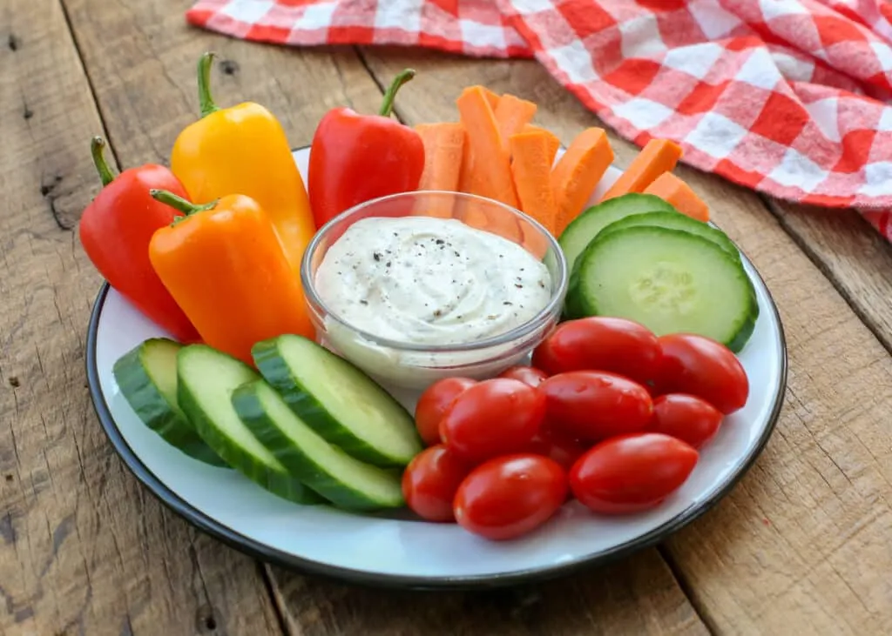

# :rice: Homemade Ranch Dip

{ loading=lazy }

| :fork_and_knife_with_plate: Serves | :timer_clock: Total Time |
|:----------------------------------:|:-----------------------: |
| 24 | 5 minutes |

## :salt: Ingredients

- 0.75 cup [mayonnaise][1]
- :glass_of_milk: 0.75 cup (170 g) sour cream
- :herb: 0.75 tsp (2 g) dried dill weed
- :herb: 0.5 tsp (1 g) dried parsley
- :apple: 0.5 tsp dried chives
- :garlic: 0.5 tsp garlic powder
- :chestnut: 0.25 tsp (1 g) onion powder
- :salt: 0.13 tsp salt
- :salt: 0.13 tsp ground black pepper
- :apple: 3 tsp lemon juice or white vinegar

## :cooking: Cookware

## :pencil: Instructions

### Step 1

Combine 3/4 cup [mayonnaise][1], 3/4 cup sour cream, 1/4 – 3/4 tsp dried dill weed, 1/2 tsp dried parsley, 1/2 tsp
dried chives, 1/2 tsp garlic powder, 1/4 tsp onion powder, 1/8 tsp salt, 1/8 tsp ground black pepper, 1-3 tsps lemon
juice or white vinegar in a small bowl. Whisk to combine. Cover and refrigerate until ready to serve.

### Step 2

This dip will keep nicely in the refrigerator for up to a week. Enjoy!

## :link: Source

- <https://barefeetinthekitchen.com/quick-and-easy-homemade-ranch-dressing>

[1]: <../../sauces-and-dressings/dips-and-spreads/mayonnaise.md>
