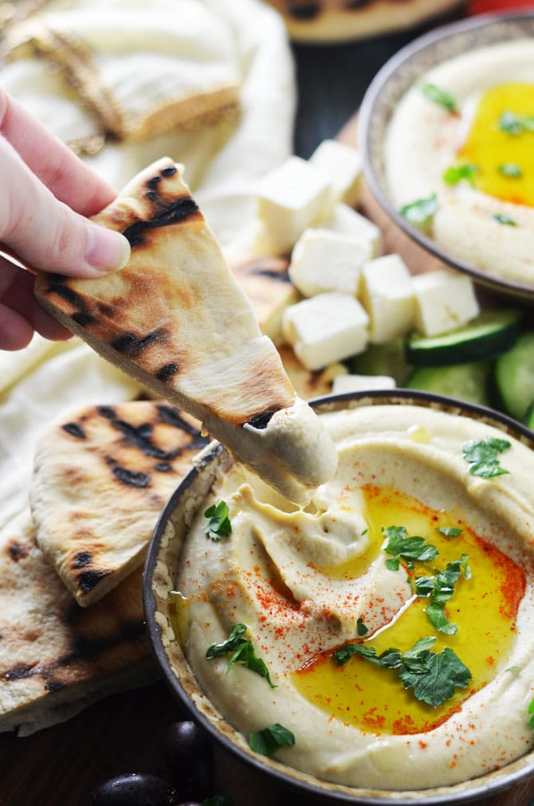

# :beans: Hummus Michael Solomonov

{ loading=lazy }

| :timer_clock: Total Time |
|:-----------------------: |
| 13.5 hours |

## :salt: Ingredients

- :beans: 1 cup (175 g) dried chickpeas
- :chestnut: 1 tsp (6 g) baking soda
- :chestnut: 1 tsp (6 g) baking soda
- :garlic: 1 head garlic
- :tangerine: 0.75 cup (170 g) lemon juice
- :salt: 0.5 tsp (2.5 g) kosher salt
- :takeout_box: 2 cups (512 g) tahini
- :chestnut: 0.5 tsp (1.5 g) ground cumin
- :salt: 1 tsp (5 g) kosher salt
- :droplet: 1.25 cups (284 g) ice water
- :takeout_box: some Tahini Sauce (from above)
- :salt: some kosher salt
- :chestnut: 0.25 tsp (0.75 g) ground cumin
- :hot_pepper: some paprika
- :herb: some fresh parsley
- :olive: some extra-virgin olive oil

## :cooking: Cookware

- :shallow_pan_of_food: 1 large pot
- :gear: 1 blender
- :wastebasket: 1 fine-mesh strainer
- :gear: 1 food processor

## :pencil: Instructions

### Step 1

SOAK AND COOK CHICKPEAS: Place **dried chickpeas** (175 g) in a large bowl with **baking soda** (6 g). Cover with plenty of water. Soak at room temperature for at least 12 hours.

### Step 2

Drain and rinse the chickpeas. Place them in a **large pot** with more **baking soda** (6 g) and cover with at least 4 inches of fresh water.

### Step 3

Bring to a boil, skimming off any foam. Reduce heat to medium, cover, and simmer for about 60 minutes until mushy and falling apart. Drain well.

### Step 4

MAKE BASIC TAHINI SAUCE: Break up **garlic** (unpeeled) and put the cloves into a **blender**. Add **lemon juice** (170 g) and **kosher salt** (2.5 g). Blend on high for a few seconds until you have a coarse puree. Let it sit for 10 minutes.

### Step 5

Pour the mixture through a **fine-mesh strainer** into a bowl, pressing hard to extract all the liquid. Discard the garlic solids.

### Step 6

Add **tahini** (512 g), **ground cumin** (1.5 g), and **kosher salt** (5 g) to the lemon-garlic liquid. Whisk until smooth.

### Step 7

Whisk in **ice water** (about 1 to 1.5 cups), a few tablespoons at a time, until the sauce is perfectly smooth, creamy, and pale.

### Step 8

COMBINE AND PUREE: In a **food processor**, combine the cooked chickpeas, 1.5 cups of the prepared Tahini Sauce (from above), **kosher salt**, and **ground cumin** (0.75 g).

### Step 9

Process for several minutes until it is uber-creamy, light, and almost fluffy.

### Step 10

Serving: Spread the hummus in a shallow bowl, creating a well in the center. Dust with **paprika**, sprinkle with chopped **fresh parsley**, and add a very generous pour of **extra-virgin olive oil**.

## :link: Source

- [Food Network](https://www.foodnetwork.com/fnk/recipes/hummus-7151796)
- [Cookie and Kate](https://cookieandkate.com/best-hummus-recipe/)
