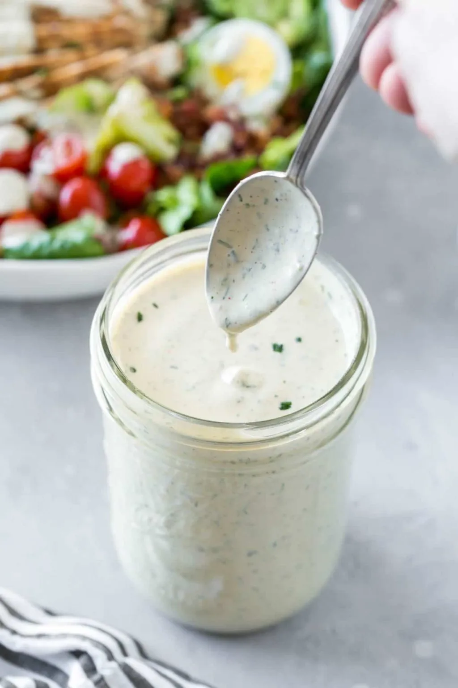

# :herb: Ranch Dressing

{ loading=lazy }

| :timer_clock: Total Time |
|:-----------------------: |
| 5 minutes |

## :salt: Ingredients

- 0.5 cup [mayonnaise][2]
- :cheese_wedge: 0.5 cup (114 g) sour cream or plain non-fat greek yogurt
- 3 Tbsp [ranch dressing mix][1]
- :droplet: 0.67 cups (152 g) [buttermilk][3] or water

## :cooking: Cookware

## :pencil: Instructions

### Step 1

In a mixing bowl; combine [mayonnaise][2], sour cream or plain non-fat greek yogurt, ranch dressing mix, and
[buttermilk][3] or water.

### Step 2

Add more [buttermilk](../../ingredients/buttermilk.md) or water to thin as desired.

## :link: Source

- <https://www.simplyscratch.com/homemade-ranch-dressing-mix/>

[1]: <../../ingredients/ranch-dressing-mix.md>
[2]: <mayonnaise.md>
[3]: <../../ingredients/buttermilk.md>
