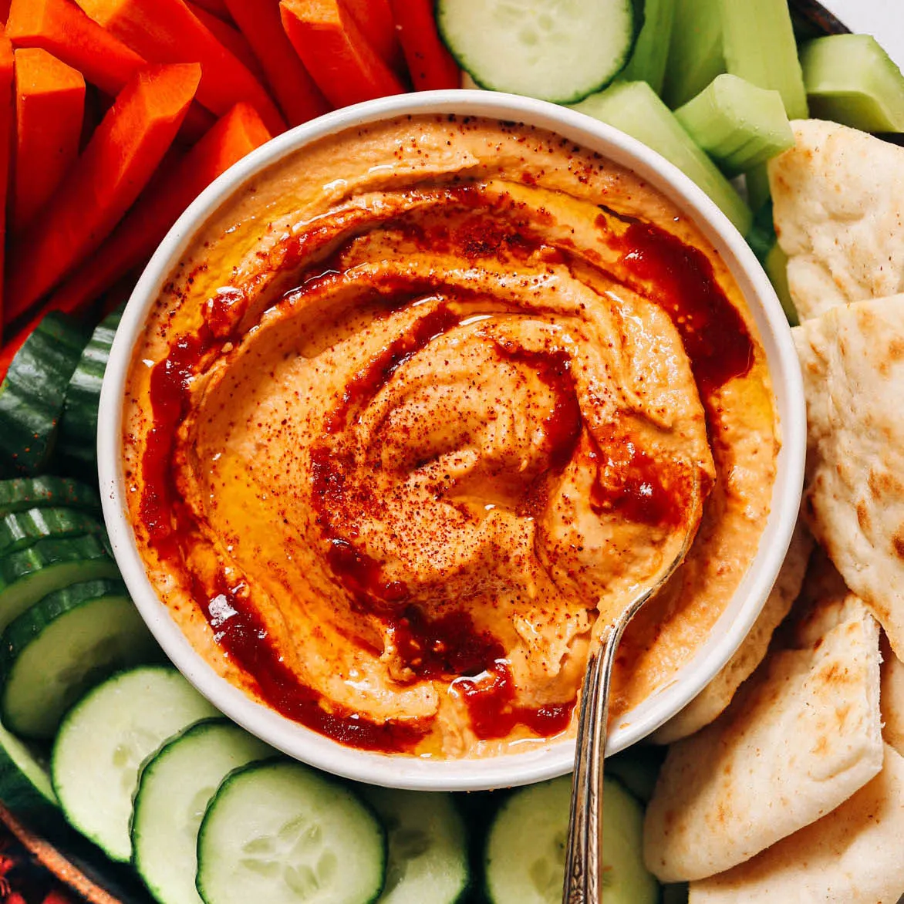

# Spicy Chipotle Hummus

{ loading=lazy }

| :fork_and_knife_with_plate: Serves | :timer_clock: Total Time |
|:----------------------------------:|:-----------------------: |
| 8 | 5 minutes |

## :salt: Ingredients

- :beans: 1 can (15-oz.) chickpeas
- :garlic: 3 cloves garlic
- :seedling: 0.5 cup (128 g) tahini
- :hot_pepper: 3 whole chipotle peppers in adobo sauce
- :tangerine: 2.5 Tbsp fresh lemon juice
- :salt: 0.75 tsp sea salt
- :olive: 1 Tbsp (12 g) extra virgin olive oil

## :cooking: Cookware

- 1 saucepan
- 1 food processor
- 1 blender

## :pencil: Instructions

### Step 1

In a small saucepan, combine the undrained chickpeas (NOT drained) and smashed garlic (2 to 4 cloves). Bring to a boil,
then reduce to a simmer for 4 to 5 minutes.

### Step 2

NOTE: Reserve 1/2 of the chickpea liquid (aquafaba) to add in as needed while blending.

### Step 3

Add the other 1/2 of the chickpea liquid and the simmered chickpeas and garlic to a food processor (or blender) and
process with tahini, chipotle peppers in adobo sauce (2 to 4 peppers), fresh lemon juice (2 to 3 Tbsp), and sea salt
(0.5 to 1 tsp). Stream in extra virgin olive oil (1 to 2 Tbsp) while mixing.

### Step 4

Process until smooth and creamy, scraping down sides as needed. Add more of the reserved chickpea liquid as needed for a
creamier texture.

### Step 5

Taste and adjust seasonings as you prefer, adding more lemon juice for brightness or more chipotle peppers for smokiness
and spice.

### Step 6

Garnish with a little more olive oil and smoked paprika, and serve.

## :link: Source

- <https://minimalistbaker.com/spicy-chipotle-hummus/>
