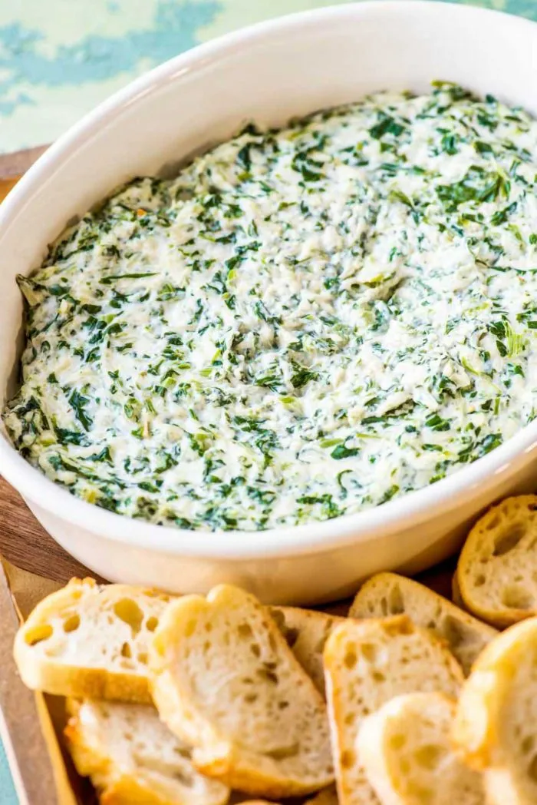

# :leafy_green: Spinach Dip

{ loading=lazy }

| :timer_clock: Total Time |
|:-----------------------: |
| 10 minutes |

## :salt: Ingredients

- :glass_of_milk: 2 cups (454 g) sour cream
- 1 cup [mayonnaise][1]
- :glass_of_milk: 1 10-oz box frozen spinach
- :stew: 1 pkg Knorr vegetable soup mix
- :beans: 0.5 cup (48 g) green onion
- :herb: 0.5 cup parsley
- :seedling: 1 tsp dill seed

## :pencil: Instructions

### Step 1

Mix together sour cream, [mayonnaise][1], frozen spinach, Knorr vegetable soup mix, green onion, parsley, and dill
seed.

### Step 2

Serve with torn up pieces of Hawaiian bread.

[1]: <../../sauces-and-dressings/dips-and-spreads/mayonnaise.md>
