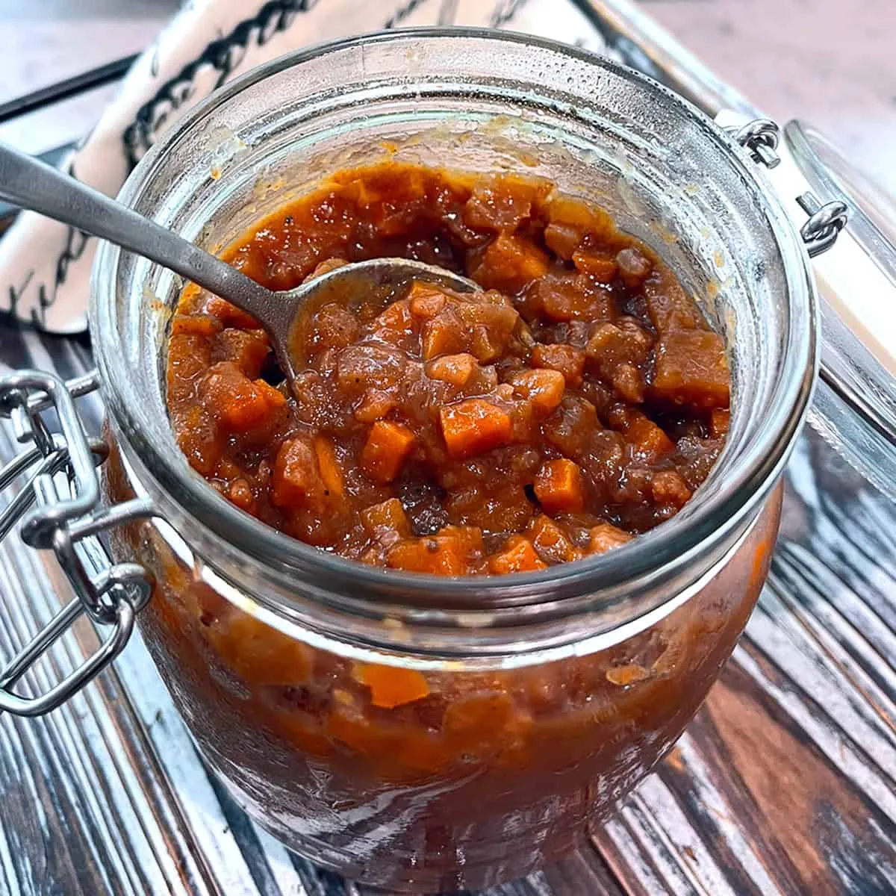

# :cucumber: Branston Pickle Copycat

{ loading=lazy }

| :fork_and_knife_with_plate: Serves | :timer_clock: Total Time |
|:----------------------------------:|:-----------------------: |
| 64 | 3.58 hours |

## :salt: Ingredients

- 1.5 cups swede/rutabaga
- 1.5 cups carrots
- 1 cup cauliflower
- 1 cup yellow onion
- 1 Granny Smith or other tart apple
- 3 ounces pitted Medjool dates
- 2 Tbsp lemon juice
- 1 cup dark brown sugar
- 1 cup malt vinegar
- 0.25 cup spirit vinegar or Essig Essenz
- 1 Tbsp Worcestershire sauce
- 2 tsp concentrated tomato paste
- 1 tsp black treacle or molasses
- 1.5 tsp kosher or sea salt
- 0.5 tsp onion powder
- 0.25 tsp garlic powder
- 0.25 tsp ground mustard
- 0.25 tsp ground coriander
- 0.13 tsp ground allspice
- 0.13 tsp ground ginger
- 0.06 tsp ground cloves
- 2 tsp cornstarch
- 2 tsp Ball Realfruit Classic Pectin

## :cooking: Cookware

- 1 medium pot
- 1 blender
- 1 pot
- 1 jars

## :pencil: Instructions

### Step 1

Chop swede/rutabaga (finely diced), carrots (finely diced), cauliflower (finely diced, using as much of the stems as
possible, reserving leftover florets for another purpose), and yellow onion (finely diced) to your desired size
(Branston's "original" has larger chunks, around 1/8-1/4 inch, versus their "small chunk" version which is finely diced)
and place them in a medium pot.

### Step 2

Place Granny Smith or other tart apple (peeled, cored, and chopped), pitted Medjool dates (chopped), and lemon juice in
a blender and puree until smooth.

### Step 3

Add the apple/date puree to the pot along with dark brown sugar (not packed), malt vinegar, spirit vinegar or Essig
Essenz (or see blog post "Ingredients" for explanation), Worcestershire sauce (vegans/vegetarians: substitute soy
sauce), concentrated tomato paste, black treacle or molasses, kosher or sea salt, onion powder, garlic powder, ground
mustard, ground coriander, ground allspice, ground ginger, and ground cloves.

### Step 4

Bring the mixture to a boil, stirring until the sugar is dissolved. Reduce the heat to low and simmer uncovered for 1.5
hours to 2 hours, stirring occasionally, or until the mixture is reduced in volume, thick, and darker (but the
vegetables still retain their shape without becoming mush). Stir frequently towards the end to prevent the mixture from
scorching. Taste and add more salt, vinegar, and/or sugar as needed.

### Step 5

If the pickle is thick enough to your liking, you can leave it as is (it will thicken up a little more when it cools).
If you prefer it thicker and you've simmered it as long as possible without the vegetables disintegrating, either add
cornstarch (dissolved in 1 Tbsp water) or Ball Realfruit Classic Pectin. In either case, return the pickle to a boil for
2 minutes to 3 minutes.

### Step 6

Spoon the Branston pickle into clean jars and seal them. Allow them to fully cool and then store the jars in the fridge
where the pickle will keep for about a month. For the best flavor, allow it to sit for a few days before using to give
the flavors time to develop. This makes roughly 1 quart of pickle. You can store it in a large quart jar or separate it
into smaller jars.

### Step 7

Storage: Stored in an airtight jar, this will keep for about a month in the fridge. Check for signs of mold or
off-smells. This recipe has not been tested for canning. Instead, for longer-term storage, freeze it in small quantities
so you can conveniently take out what you need. It will freeze for up to 4 months.

## :link: Source

- <https://www.daringgourmet.com/homemade-branston-pickle-recipe/>
