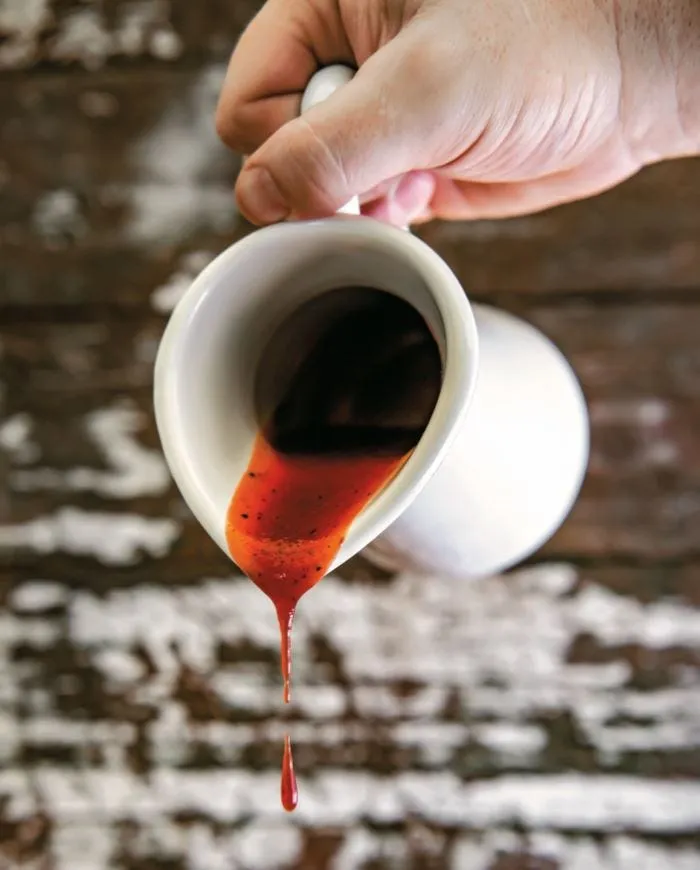

# :cherries: Cherry Bourbon Barbecue Sauce

{ loading=lazy }

| :timer_clock: Total Time |
|:-----------------------: |
| 30 minutes |

## :salt: Ingredients

- :cherries: 1 cup (280 g) unsweetened cherry juice
- :honey_pot: 0.33 cup honey
- :tomato: 1 cup ketchup
- :candy: 0.33 cup (75 g) light [brown sugar](../../ingredients/brown-sugar.md)
- :tomato: 0.25 cup [tomato paste](../../ingredients/tomato-paste.md)
- :takeout_box: 0.25 cup (85 g) cider vinegar
- :tumbler_glass: 3 Tbsp bourbon
- :hot_pepper: 2 tsp (10 g) hot sauce
- :salt: 1.5 tsp kosher salt
- :salt: 1 tsp (3 g) freshly ground black pepper
- :garlic: 1 tsp granulated garlic
- :onion: 1 tsp (2 g) onion powder
- :onion: 0.5 tsp (2 g) dry mustard
- :salt: 0.5 tsp [celery salt](../../ingredients/seasonings/celery-salt.md)

## :cooking: Cookware

- 1 medium saucepan
- 1 jar

## :pencil: Instructions

### Step 1

In a medium saucepan, combine unsweetened cherry juice, honey, ketchup,
light [brown sugar](../../ingredients/brown-sugar.md), [tomato paste](../../ingredients/tomato-paste.md), cider vinegar,
bourbon, hot sauce, kosher salt, freshly ground black pepper, granulated garlic, onion powder, dry mustard, and
[celery salt](../../ingredients/seasonings/celery-salt.md). Bring to a gentle boil over medium heat, stirring to
dissolve the sugar.

### Step 2

Lower heat to low and simmer until slightly thickened, 20 to 25 minutes, stirring frequently.

### Step 3

Let cool, transfer to a jar and store in the refrigerator for up to a month.

## :link: Source

- <https://www.statesman.com/story/lifestyle/food/2020/12/18/all-your-christmas-ham-needs-cherry-bourbon-barbecue-sauce/3888883001/>
