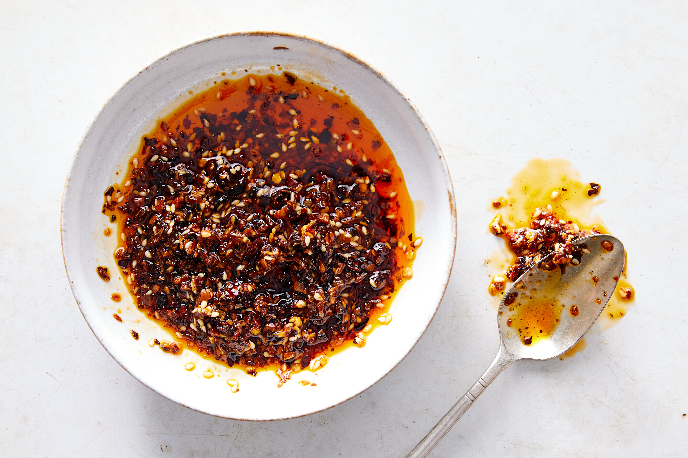

# :hot_pepper: Chile Crisp

{ loading=lazy }

| :fork_and_knife_with_plate: Serves | :timer_clock: Total Time |
|:----------------------------------:|:------------------------:|
| 1 1/4 cups                         | 6 minutes                |

## :salt: Ingredients

- :olive: 1/2 cup (99 g) vegetable oil
- :tea: 1/4 cup (24 g) dried minced onion
- :candy: 1 tsp (4 g) granulated sugar, divided
- :salt: 1 1/2 tsp (4 g) Diamond Crystal kosher salt, divided
- :hot_pepper: 1/3 cup (28 g) crushed dried small red chiles or red-pepper flakes
- :seedling: 3 Tbsp (27 g) sesame seeds
- :hot_pepper: 1 tsp (3 g) coarsely ground Sichuan peppercorns, optional

## :cooking: Cookware

- :shallow_pan_of_food: 1 small saucepan
- :package: 1 airtight container

## :pencil: Instructions

### Step 1

Combine the vegetable oil, dried minced onion, granulated sugar, and Diamond Crystal kosher salt in a small saucepan.
Cook over medium heat, stirring occasionally, until the onion becomes evenly golden brown, 3 to 5 minutes.

### Step 2

Add the crushed dried small red chiles or red-pepper flakes, sesame seeds, and coarsely ground Sichuan peppercorns
(optional), if using, and sizzle, stirring, for 1 minute, then stir in the remaining granulated sugar and Diamond
Crystal kosher salt.

### Step 3

Use immediately or refrigerate in an airtight container for up to 2 weeks. Spoon over everything. It adds big flavor to
milder bases, such as eggs, tofu, noodles, rice, vegetables, white fish, lean pork and chicken breast.

## :link: Source

- <https://cooking.nytimes.com/recipes/1022366-chile-crisp>
