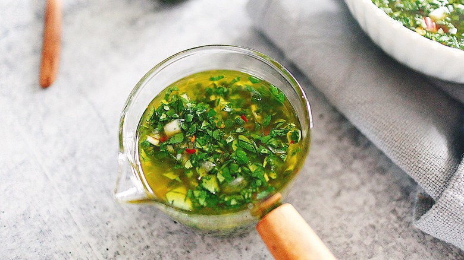

# :herb: Chimichurri

{ loading=lazy }

| :fork_and_knife_with_plate: Serves | :timer_clock: Total Time |
|:----------------------------------:|:-----------------------: |
| 6 | 35 minutes |

## :salt: Ingredients

- :wine_glass: 0.5 cup (105 g) red wine vinegar
- :tangerine: 1 lemon juice
- :garlic: 1 small shallot
- :garlic: 5 cloves garlic
- :herb: 0.75 parsley
- :herb: 0.5 cup (21 g) cilantro
- :herb: 1 Tbsp oregano
- 2 Tbsp (5 g) chives
- :hot_pepper: 0.5 tsp (2 g) red pepper
- :olive: 0.75 cup (150 g) olive oil
- :salt: 2 tsp salt
- :salt: 0.5 tsp pepper

## :cooking: Cookware

- 1 bowl

## :pencil: Instructions

### Step 1

Combine the red wine vinegar, lemon juice, minced shallot, garlic, parsley, cilantro, oregano, chives, and red pepper
together in a bowl.

### Step 2

Whisk the olive oil into the other ingredients.

### Step 3

Season the chimichurri with salt and pepper, and feel free to add more or less to taste.

### Step 4

Let the chimichurri stand at room temperature for 20 minutes.

### Step 5

Refrigerate if not used immediately, but allow the mixture to come to room temperature before serving.

## :link: Source

- <https://www.tastingtable.com/843601/fresh-chimichurri-sauce-recipe/>
